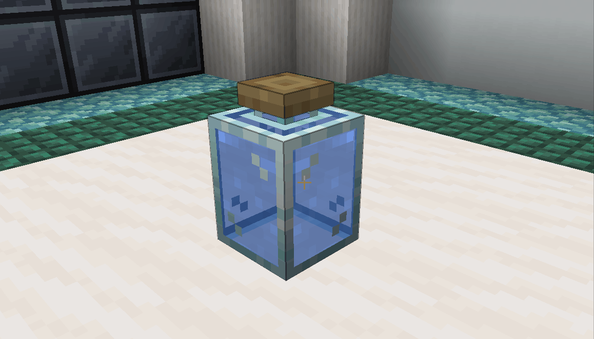
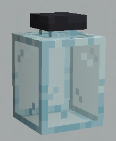
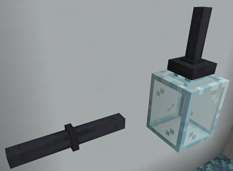
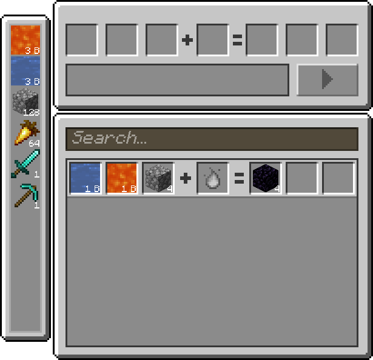
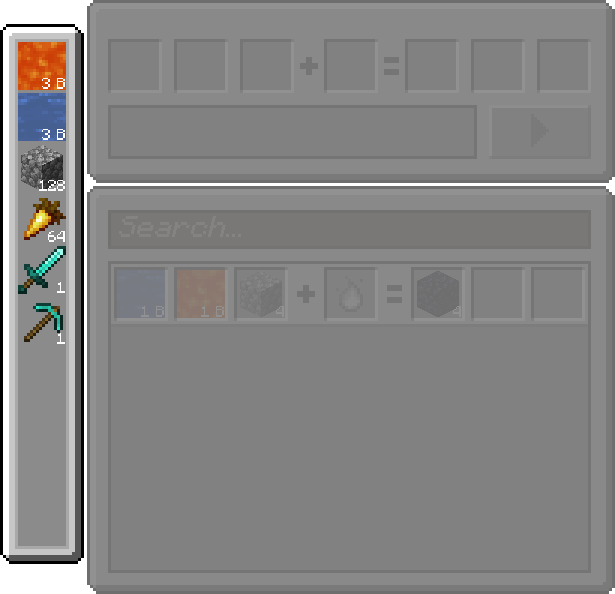
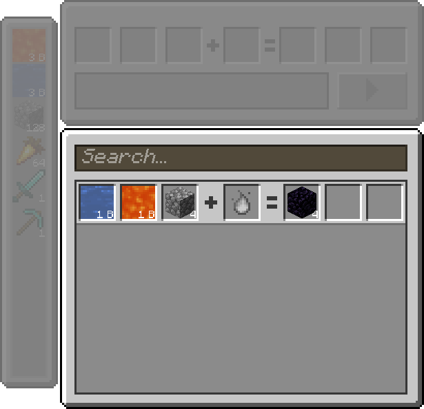
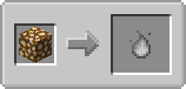
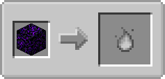
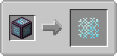
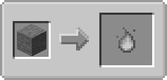

# Glass Jar

Glass Jars are transparent containers that can hold liquid and supply it to recipes in the FTB Jar Mod. The cork of the Glass Jar is made out of cork.

The fluid they can hold can be hot, cold, or even come from mods! They will not break, even if lava is placed inside them. Each Glass Jar can contain up to 8 buckets (8000 mb) of fluid.

Glass Jars will only connect to Iron Cast Tubes at their top, not at their sides or bottom. Fluid containers from other mods don't have this restriction however.

Glass Jars do not retain their contents when broken. They really are meant only for providing fluids for crafting!

# Tempered Glass Jar

Tempered Glass Jars are also transparent jars, but they differ in appearance and function. The glass is more foggy, and the cork is made out of metal instead. Contrary to Glass Jars, Tempered Glass Jars cannot hold any fluids.

Tempered Glass Jars are used to craft in the FTB Jar Mod.

Tempered Glass Jars, like Glass Jars, also connect to Iron Cast Tubes only at the top where the cork is.

To start crafting recipes, you need to connect a Tempered Glass Jar to chests or other filled Glass Jars. For example, you could have this setup:

If you use the Tempered Glass Jar, you will be shown a menu in order to be able to craft.

By default no recipes are added by the mod, but for the sake of this example, we added a recipe to make obsidian that uses 1 bucket of lava, 1 bucket of water and 4 cobblestone.

In the left part of the menu, you will have a short list of some of your available inventory items and fluids for the recipes. This will also show materials in connected chests and fluids in connected Glass Jars.

In the bottom-right part of the interface is where recipes will be shown to you and where you can select them.

In the top-right part of the interface, which is currently empty, will allow you to craft a selected recipe.

The Tempered Glass Jar will detect items in the player inventory, in connected chests and fluids in connected Glass Jars. Here is an example that shows how you can craft a recipe by using the Tempered Glass Jar.

Here, the player is holding the necessary items directly inside the inventory.

# Temperature

Tempered Glass Jars use temperature in order to craft items. Temperature can come from a block directly under the Tempered Glass Jar. There are four different levels of temperature:

| Temperature | Icon | Effect |
|:--:|:--:|:--:|
| None |  |  |
| Low |  |  |
| High |  |  |
| Sub-Zero |  |  |

FTB Jar Mod also adds temperature to some blocks by default. These can be disabled by removing the temperature recipes, for example, using [KubeJS](https://www.curseforge.com/minecraft/mc-mods/kubejs-forge) or [CraftTweaker](https://www.curseforge.com/minecraft/mc-mods/crafttweaker).

This section will also be covered more in details in the [KubeJS integration](../for-kubejs.md#temperature-sources-recipes) and [datapack](../for-datapacks.md) documents.

| Block | Efficiency | 
Visual Recipe
 | Recipe ID |
|:--:|:--:|:--:|:--:|
| `minecraft:respawn_anchor` | 8.0x |  | `ftbjarmod:temperature_sources/respawn_anchor` |
| `minecraft:glowstone` | 1.25x |  | `ftbjarmod:temperature_sources/glowstone_block` |
| `minecraft:crying_obsidian` | 3.0x |  | `ftbjarmod:temperature_sources/crying_obsidian` |
| `minecraft:torch` & `minecraft:wall_torch` | 0.25x |  | `ftbjarmod:temperature_sources/torch` & `ftbjarmod:temperature_sources/wall_torch` |
| `minecraft:fire` | 0.75x |  | `ftbjarmod:temperature_sources/fire` |
| `minecraft:lava` | 4.0x |  | `ftbjarmod:temperature_sources/lava` |
| `minecraft:campfire` | 0.5x |  | `ftbjarmod:temperature_sources/campfire` |
| `minecraft:magma_block` | 0.5x |  | `ftbjarmod:temperature_sources/magma_block` |
| `minecraft:soul_fire` | 0.75x |  | `ftbjarmod:temperature_sources/soul_fire` |
| `minecraft:beacon` | 4.0x |  | `ftbjarmod:temperature_sources/beacon` |
| `ftbjarmod:blue_magma_block` | 1.0x |  | `ftbjarmod:temperature_sources/blue_magma_block` |
| `minecraft:soul_campfire` | 0.5x |  | `ftbjarmod:temperature_sources/soul_campfire` |
| `minecraft:blue_ice` | 4.0x |  | `ftbjarmod:temperature_sources/blue_ice` |
| `minecraft:packed_ice` | 1.0x |  | `ftbjarmod:temperature_sources/packed_ice` |
| `minecraft:ice` | 0.25x |  | `ftbjarmod:temperature_sources/ice` |

## Creative temperature sources

There are also some creative sources for temperatures other than "None". They can also be disabled by removing their temperature recipes (see KubeJS integration and datapack documents from earlier). Creative Temperature Sources do not display in Temperature Recipes by default, but you can force them to if you want.
| Block | Efficiency | 
Visual Recipe
 | Recipe ID |
|:--:|:--:|:--:|:--:|
| `ftbjarmod:creative_low_temperature_source` | 100.0x |  | `ftbjarmod:temperature_sources/creative_low` |
| `ftbjarmod:creative_high_temperature_source` | 100.0x |  | `ftbjarmod:temperature_sources/creative_high` |
| `ftbjarmod:creative_subzero_temperature_source` | 100.0x |  | `ftbjarmod:temperature_sources/creative_subzero` |

## Blocks with no temperature

Blocks that don't have any temperature will automatically be given the "none" temperature.
| Block | Efficiency | 
Visual Recipe
 | Recipe ID |
|:--:|:--:|:--:|:--:|
| Any other block | 1.0x |  | No ID, cannot be changed |