import Tabs from '@theme/Tabs';
import TabItem from '@theme/TabItem';

# Minimap

The minimap in FTB Chunks is situated in the upper-right corner of the screen, displaying information about the environment around the player.

It can also show coordinates or other positional information.

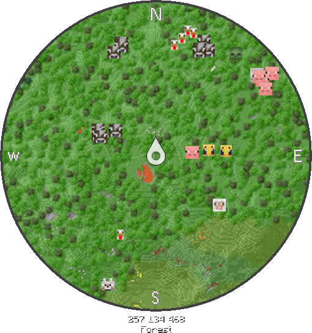

## Configuration

To configure the minimap, press the key to open the world map (default: 'm' key).

Then, locate the settings cog in the lower-left corner of the screen and click it. Alternatively, press the 's' key.

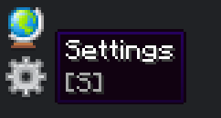

On the "Minimap" tab you'll be able to configure settings.

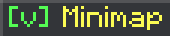

### Enabled

Default: true

True enables the minimap, false disables it so it is no longer shown on screen.

todo slider

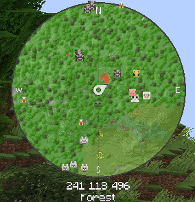
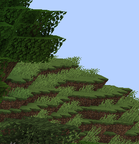

### Position

Default: Top Right

Six arrangements are possible for the position of the minimap.

<Tabs>
<TabItem value="position-top-right" label="Top Right" default>

  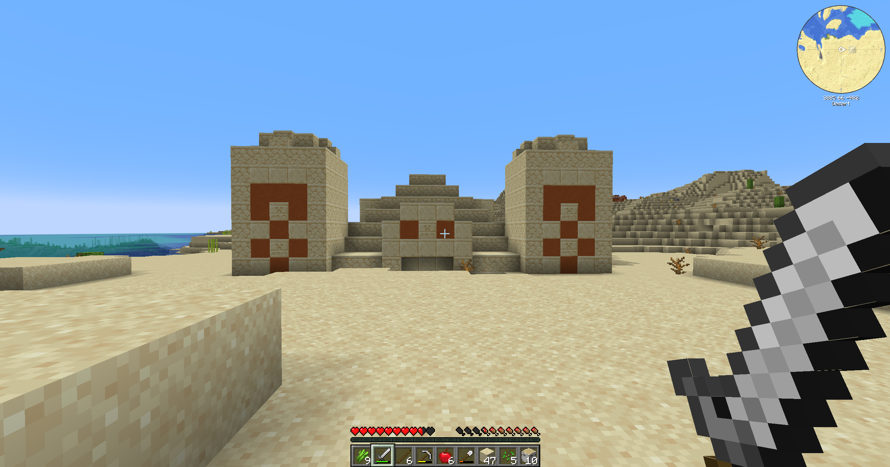

</TabItem>
<TabItem value="position-right" label="Right">

  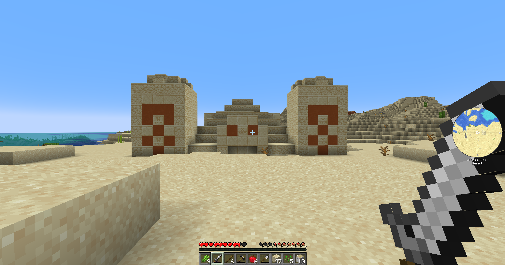

</TabItem>
<TabItem value="position-bottom-right" label="Bottom Right">

  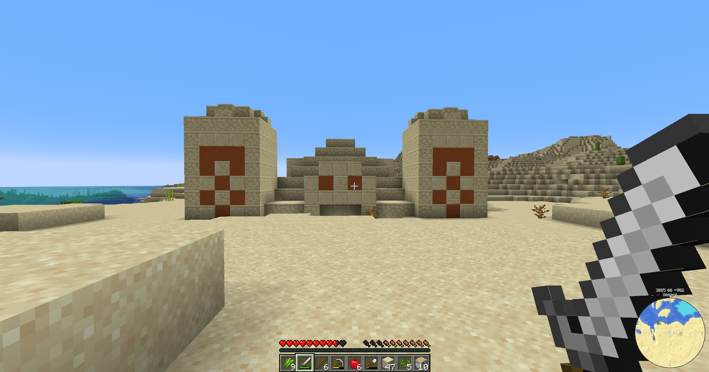

</TabItem>
<TabItem value="position-bottom-left" label="Bottom Left">

  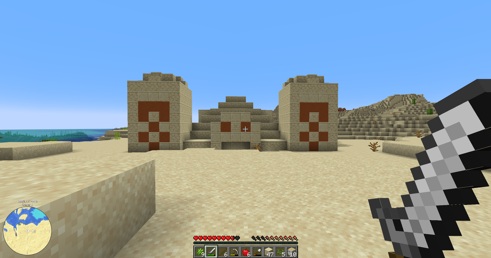

</TabItem>
<TabItem value="position-left" label="Left">

  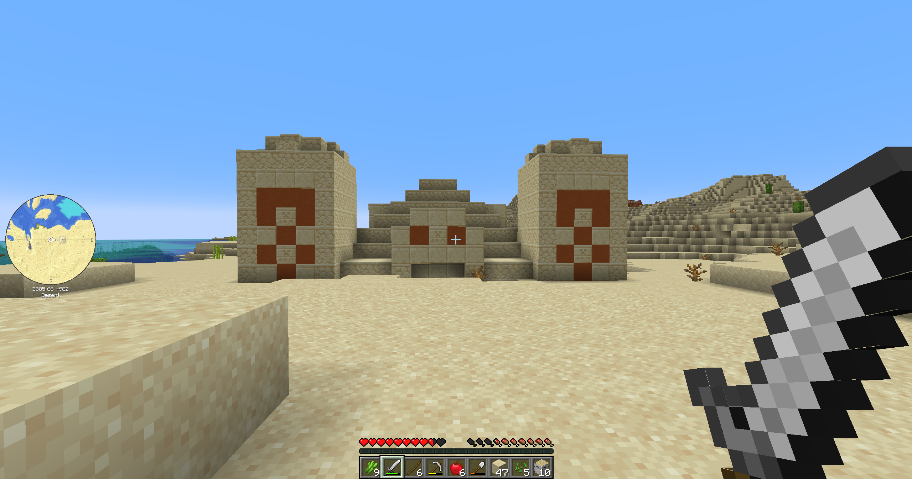

</TabItem>
<TabItem value="position-top-left" label="Top Left">

  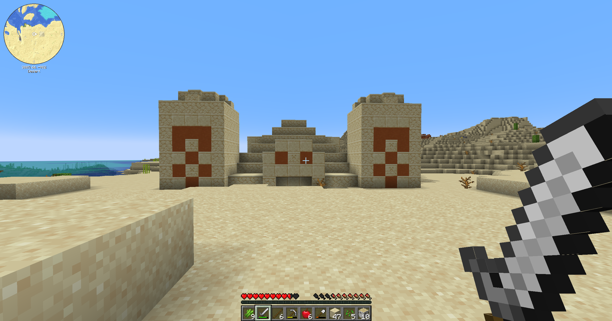

</TabItem>
</Tabs>

### Scale

Adjusts the size of the minimap.

Between 0.25 and 4.00 inclusive (default: 1).

todo image carousel that states scale level per image

<Tabs>
<TabItem value="scale-0.25" label="0.25">

  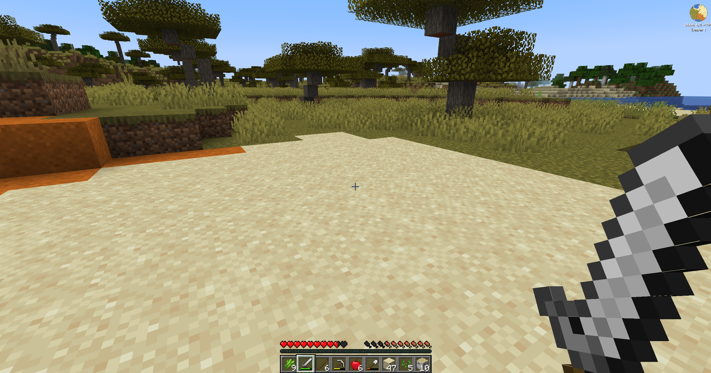

</TabItem>
<TabItem value="scale-1" label="1.00" default>

  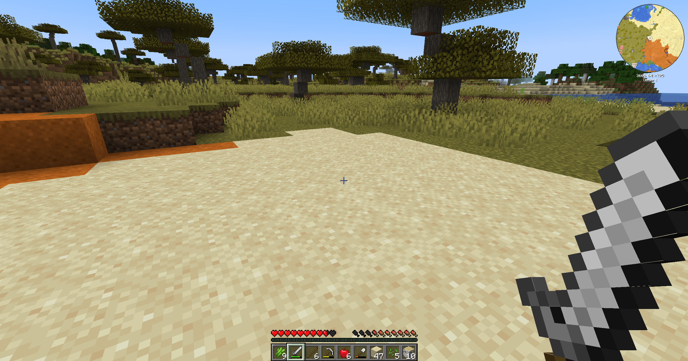

</TabItem>
<TabItem value="scale-2.5" label="2.50">

  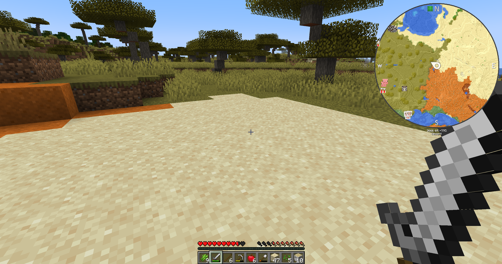

</TabItem>
<TabItem value="scale-4" label="4.00">

  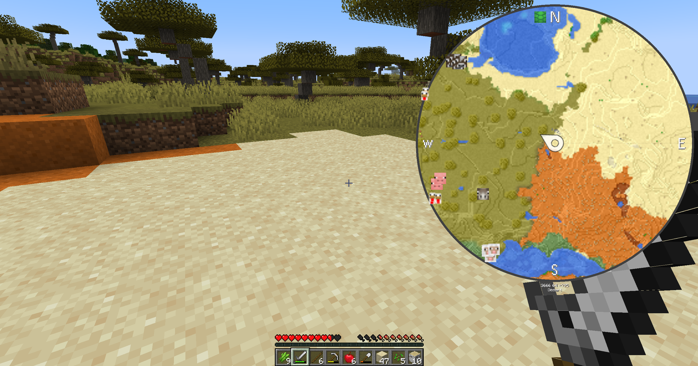

</TabItem>
</Tabs>

### Font Scaling

Adjusts the size of the font under the minimap. Best used in conjunction with [scale](#scale).

Between 0.10 and 5.00 inclusive (default: 0.5).

:::tip

Setting [scale](#scale) and font scaling to the same value will scale them proportionally.

:::

todo image carousel that states scale and font scaling per image (they are the same as the image names)

<Tabs>
<TabItem value="font-scaling-0.5" label="0.5">

  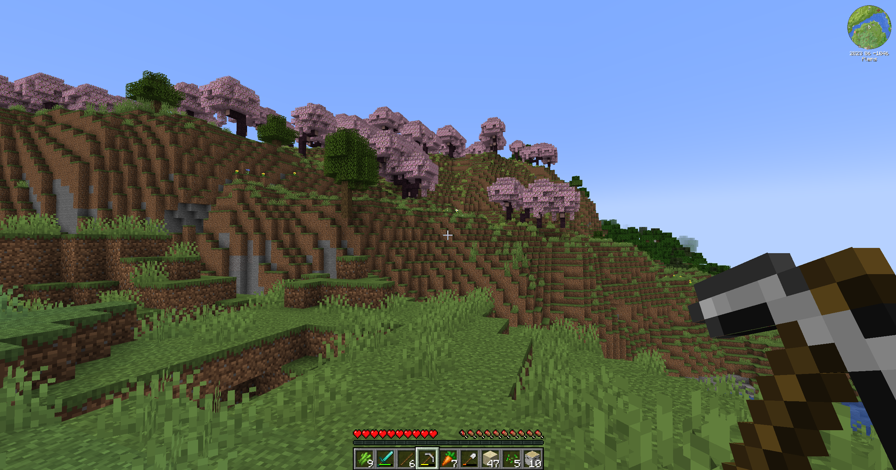

</TabItem>
<TabItem value="font-scaling-1" label="1.00" default>

  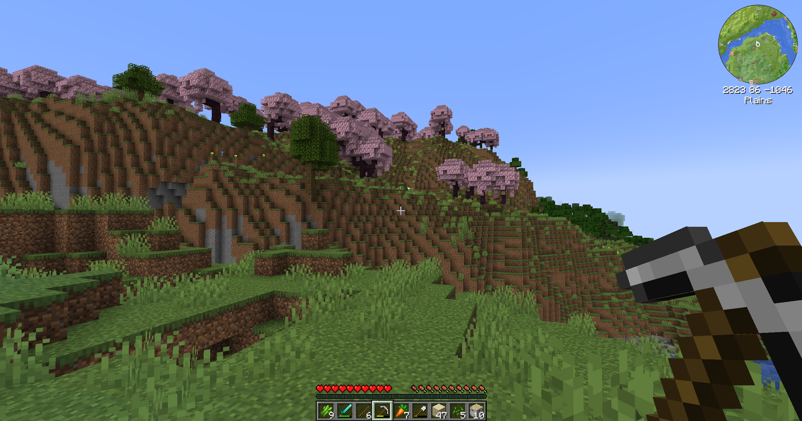

</TabItem>
<TabItem value="font-scaling-2" label="2.00">

  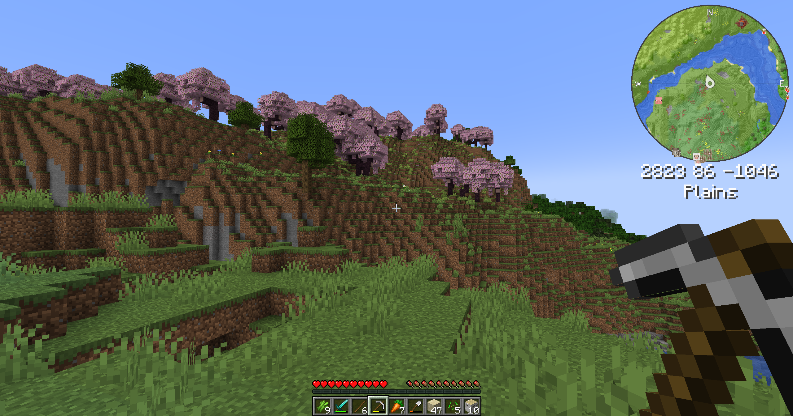

</TabItem>
<TabItem value="font-scaling-3" label="3.00">

  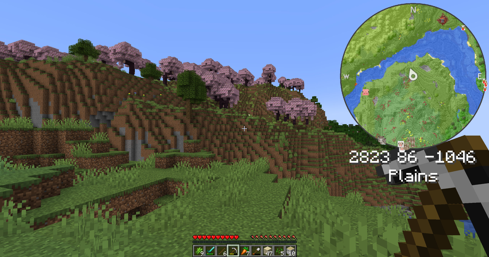

</TabItem>
</Tabs>

### Zoom

Adjusts the level of zoom the minimap has.

Between 1 and 4 inclusive (default: 1).

:::tip

The keybinds "Zoom In Minimap" (default: '=') and "Zoom Out Minimap" (default: '-') can be used to zoom in and out!

:::

### Locked North

Default: true

If true, locks the minimap onto place.

If false, it will be allowed to rotate with the player like in the following figure.

### Show player when not locked north

Default: true

:::tip

Use when [locked north](#locked-north) is set to false!

:::

If true, a player marker will be shown in the center of the minimap.

If false, no marker will be shown, such as in the following figure.

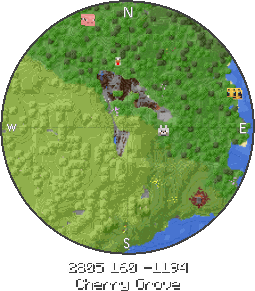

### Waypoints

Default: true

True shows the [waypoints](./Waypoints.md) in the minimap, false hides them.

todo slider

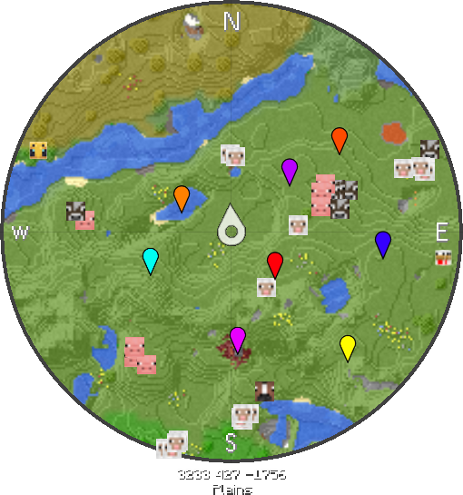
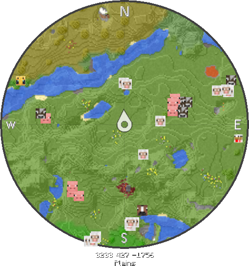

### Player heads

Default: true

True displays an icon for the heads of other players on the minimap, false will hide them.

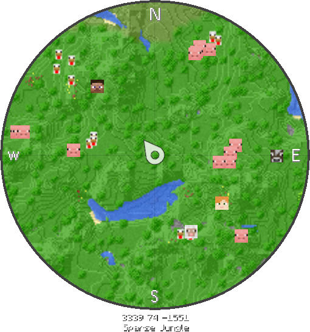
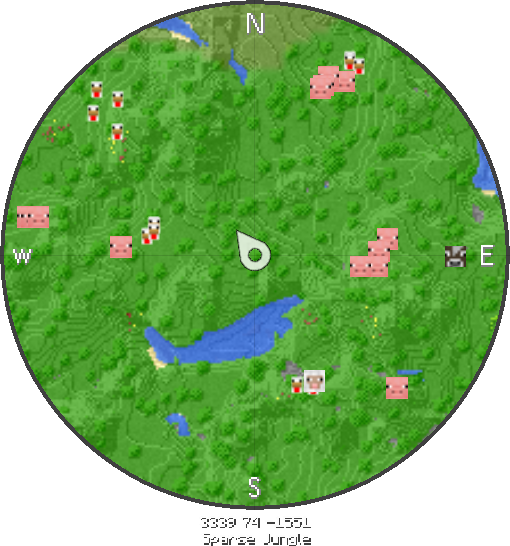

### Entities

Default: true

True will display entities (mobs, items, players, etc.) and false will hide them from the minimap.

todo slider

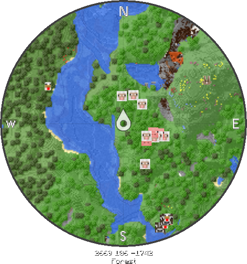

### Entity heads

Default: true

True will display entities on the minimap using an icon for their heads (when possible); false will instead display them as white dots.

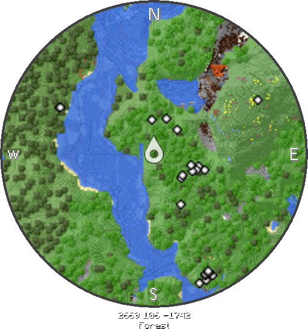

### Large entities

Default: false

Large entities will increase the size of entity heads if set to true.

If the entity heads are being displayed as white dots instead, it will also increase their size.

todo carousel

<Tabs>
<TabItem value="entity-heads" label="Standard" default>

  

</TabItem>
<TabItem value="entity-large-heads" label="Large Heads">

  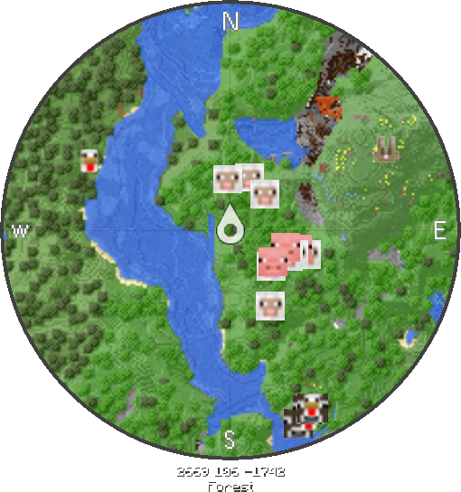

</TabItem>
<TabItem value="entity-large-dots" label="Large Dots">

  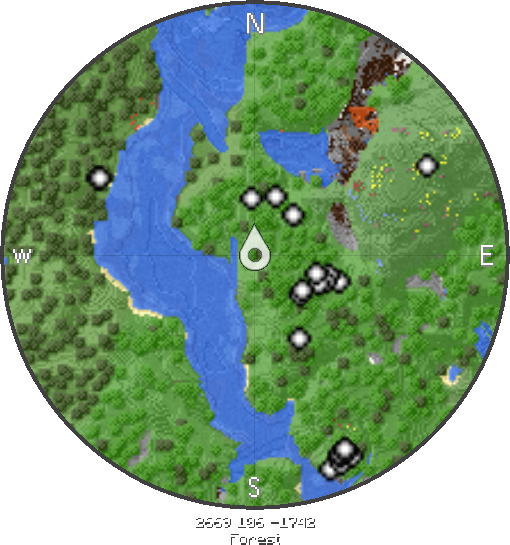

</TabItem>
</Tabs>

### XYZ

Default: true

Set to true to display the coordinates of the block within the legs and feet of the player; set to false to hide them.

todo slider

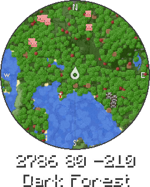
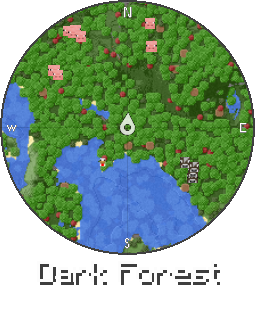

### Biome

Default: true

Set to true to display the current biome the player is in; set to false to hide it.

todo slider

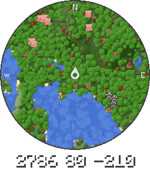
