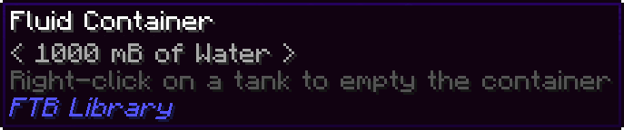

# Configuration of the FTB Jar Mod

The FTB Jar Mod does not have any client or server configuration offered.

Everything is done by modifying recipes, such as through KubeJS integration or datapack.

If you need to hide the fluid containers items added by FTB Library in the recipe browser, you need to use mods such as [KubeJS](https://www.curseforge.com/minecraft/mc-mods/kubejs-forge) or [CraftTweaker](https://www.curseforge.com/minecraft/mc-mods/crafttweaker).




Here is a quick example using KubeJS in Minecraft 1.16.5. You will need to put this into a JavaScript file (`.js`) located in the `kubejs/client_scripts` folder.

For example, `kubejs/client_scripts/hide_items.js` could contain the following text to hide all fluid containers when using [JEI](https://www.curseforge.com/minecraft/mc-mods/jei):

```js
onEvent("jei.hide.items", (event) => {
    //Hide all fluid containers from FTB Library
    event.hide(/^ftblibrary:fluid_container/g);
});
```

Something to keep in mind while hiding fluid containers is that the [output behavior](./Contents/Tempered%20Glass%20Jars.md#output-behavior) of the Tempered Glass Jars will not change.
