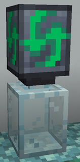
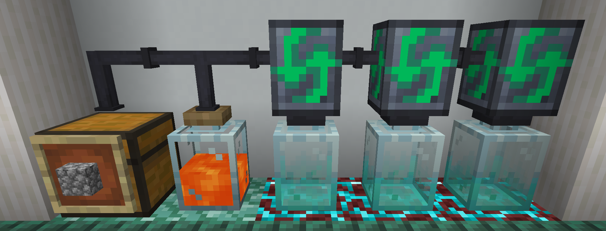
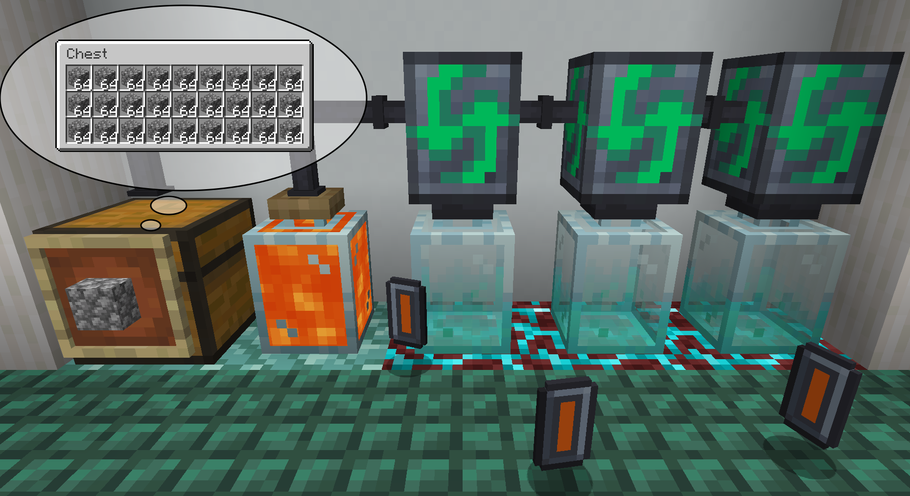

# Jar Auto-Processing Block for automated crafting

FTB Jar Mod allows players to automate [Tempered Glass Jars](./Tempered%20Glass%20Jars.md) by placing a Jar Auto-Processing Block on top of each jar they wish to automate.

The Jar Auto-Processing Block will change the behavior of the [Tempered Glass Jar](./Tempered%20Glass%20Jars.md), which will now attempt to craft the last selected recipe indefinitely.

::: tip Continuous crafting
If materials for the craft run out, the Jar Auto-Processing Block will automatically resume crafting once more materials become available.
:::

|  |
|:--:|
| An example of a simple [cobblestone to lava](../KubeJS%20Integration/Tempered%20Glass%20Jar%20Recipes.md#cobblestone-to-lava-under-high-temperature) automation using the Jar Auto-Processing Block |

## Chaining

The Jar Auto-Processing Block also can be linked to other Jar Auto-Processing Blocks simply by placing them adjacently to each other. Additional Jar Auto-Processing Blocks will be connected to item or fluid containers in the system automatically!

## Output behavior

Jar Auto-Processing Blocks use the same [output behavior](./Tempered%20Glass%20Jars.md#output-behavior) of [Tempered Glass Jars](./tempered-glass-jars.md).

If all containers are full, only one item is outputted in the world and the automatic crafting process comes to a stop until it is restarted by the player.

|  |
|:--:|
| Lava production that came to a halt because of filled containers. |
