# Temperature

[Tempered Glass Jars](./Tempered%20Glass%20Jars.md) use temperature in order to craft items. Temperature can come from a block directly under the [Tempered Glass Jars](./Tempered%20Glass%20Jars.md). There are four different levels of temperature:

| Temperature | Icon | Effect |
|:--:|:--:|:--:|
| None | 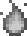 | 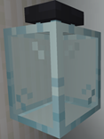 |
| Low |  | 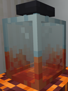 |
| High |  | 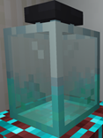 |
| Sub-Zero |  | 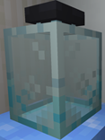 |

FTB Jar Mod also adds temperature to some blocks by default. These can be disabled by removing the temperature recipes, for example, using [KubeJS](https://www.curseforge.com/minecraft/mc-mods/kubejs-forge), [CraftTweaker](https://www.curseforge.com/minecraft/mc-mods/crafttweaker) or datapacks.

This section will also be covered more in details in the documents for KubeJS integration or datapack.

| Block | Efficiency | Visual Recipe | Recipe ID |
|:--:|:--:|:--:|:--:|
| `minecraft:respawn_anchor` | 8.0x |  | `ftbjarmod:temperature_sources/respawn_anchor` |
| `minecraft:glowstone` | 1.25x | 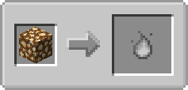 | `ftbjarmod:temperature_sources/glowstone_block` |
| `minecraft:crying_obsidian` | 3.0x | 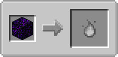 | `ftbjarmod:temperature_sources/crying_obsidian` |
| `minecraft:torch` & `minecraft:wall_torch` | 0.25x | 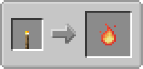 | `ftbjarmod:temperature_sources/torch` & `ftbjarmod:temperature_sources/wall_torch` |
| `minecraft:fire` | 0.75x | 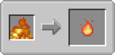 | `ftbjarmod:temperature_sources/fire` |
| `minecraft:lava` | 4.0x | 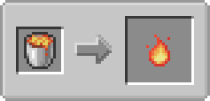 | `ftbjarmod:temperature_sources/lava` |
| `minecraft:campfire` | 0.5x |  | `ftbjarmod:temperature_sources/campfire` |
| `minecraft:magma_block` | 0.5x | 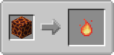 | `ftbjarmod:temperature_sources/magma_block` |
| `minecraft:soul_fire` | 0.75x |  | `ftbjarmod:temperature_sources/soul_fire` |
| `minecraft:beacon` | 4.0x | 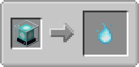 | `ftbjarmod:temperature_sources/beacon` |
| `ftbjarmod:blue_magma_block` | 1.0x |  | `ftbjarmod:temperature_sources/blue_magma_block` |
| `minecraft:soul_campfire` | 0.5x | 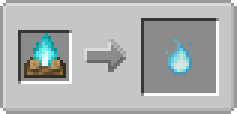 | `ftbjarmod:temperature_sources/soul_campfire` |
| `minecraft:blue_ice` | 4.0x | 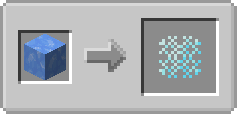 | `ftbjarmod:temperature_sources/blue_ice` |
| `minecraft:packed_ice` | 1.0x | 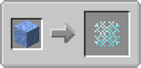 | `ftbjarmod:temperature_sources/packed_ice` |
| `minecraft:ice` | 0.25x | 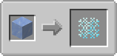 | `ftbjarmod:temperature_sources/ice` |

## Creative temperature sources

There are also some creative sources for temperatures other than "none". They can also be disabled by removing their temperature recipes (see KubeJS integration and datapack documents). Creative temperature sources do not display in temperature recipes by default, but you can force them to if you want.

| Block | Efficiency | Visual Recipe | Recipe ID |
|:--:|:--:|:--:|:--:|
| `ftbjarmod:creative_low_temperature_source` | 100.0x | 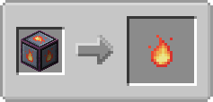 | `ftbjarmod:temperature_sources/creative_low` |
| `ftbjarmod:creative_high_temperature_source` | 100.0x | 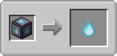 | `ftbjarmod:temperature_sources/creative_high` |
| `ftbjarmod:creative_subzero_temperature_source` | 100.0x | 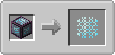 | `ftbjarmod:temperature_sources/creative_subzero` |

## Blocks with no temperature

Blocks that don't have any temperature will automatically be given the "none" temperature.

| Block | Efficiency | Visual Recipe | Recipe ID |
|:--:|:--:|:--:|:--:|
| Any other block | 1.0x | 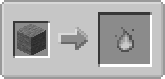 | No ID, cannot be changed |
