# Usage of the questbook in FTB Quests

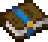

The questbook is an item in the FTB Quests mod. Upon being opened with the use button, the questbook displays a user view of some quests. The questbook can also be accessed in the inventory through a button, in the top left corner.

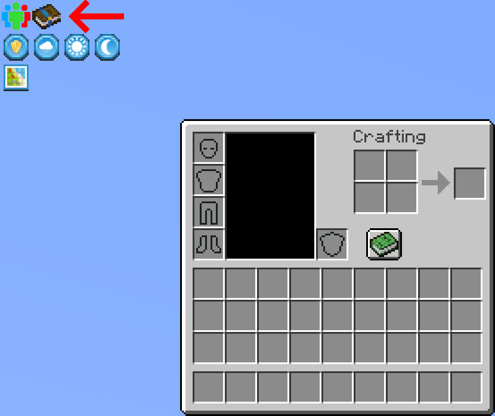

If the player is not playing in a modpack that was designed with quests, the questbook will be empty.

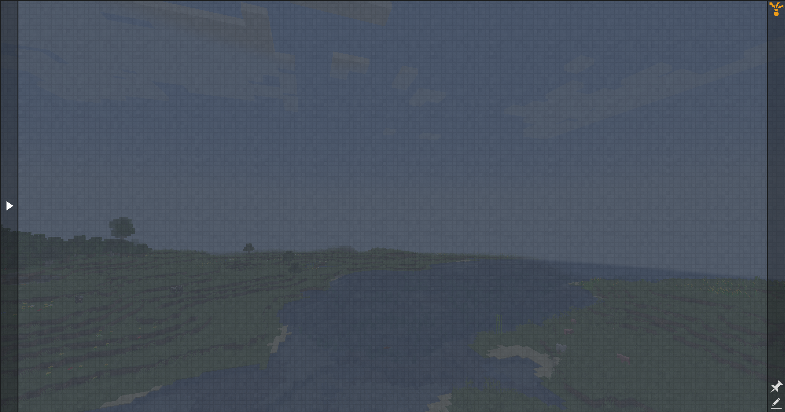

In progression style modpacks however, the questbook may be filled with chapters and quests for the player to complete. Here is what we'll be using for this demo.

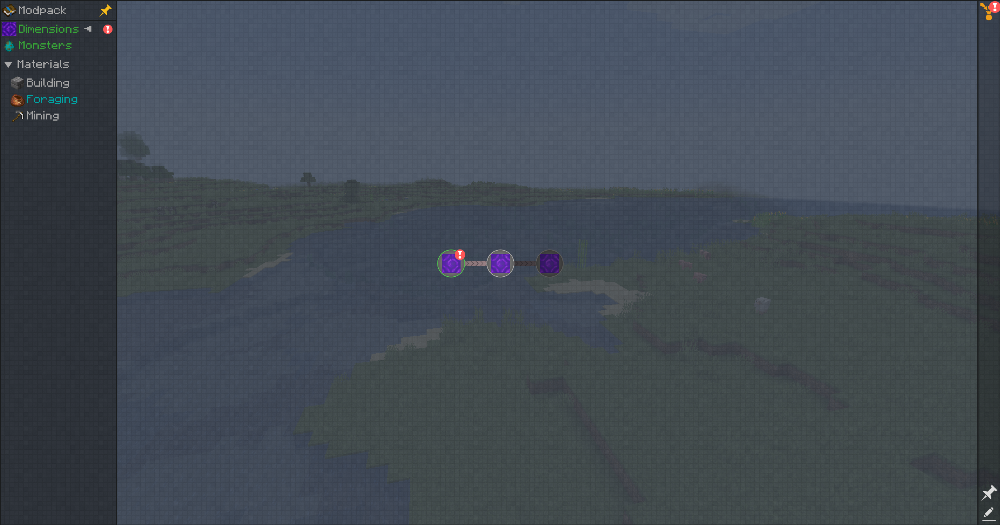

## General navigation and questing

Upon sliding the cursor to the left of the window, onto the arrow, the view will expand and you see all available chapters in a made progression modpack. You will also be able to pin that tab if you want, using the pin icon at the top.

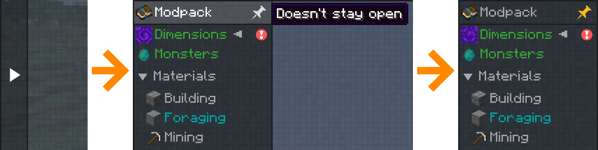

Click on one of the chapters to begin and a small grey arrow will appear next to the chapter indicating you've selected it. Here, "Monsters" is selected.

Alternatively, you can also use the `Tab` key to move along the chapters more swiftly.

Next is the main window, where quests are actually contained. Press `+` or `-` on your keyboard or use the mouse scroll to zoom in and out. Left-click and hold anywhere in an empty space to reposition the view.

Hover a quest to see a short summary, for example the quest with the rotten flesh icon shows that the quest is repeatable, which means you can complete it multiple times and claim its rewards everytime.

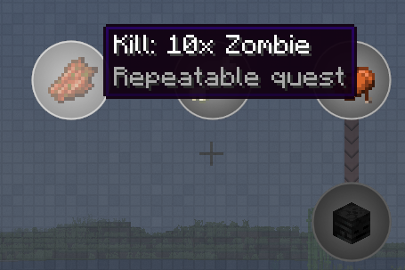

Left-click on the quest to read more about its requirements and rewards. Sometimes you will have to complete multiple tasks inside one quest, although in this example only one seems visible, indicated by the rotten flesh icon on the left.

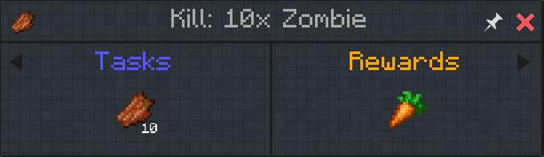

Hovering tasks or rewards with your cursor will give you useful information.

Here we are told our progress towards killing 10 zombies and that the rewards will be one of our choice between the listed items.

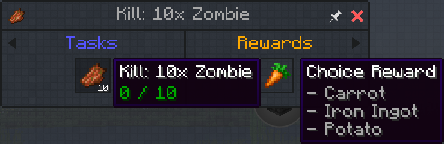

Let's wait until nightime and find some zombies to complete the quest!

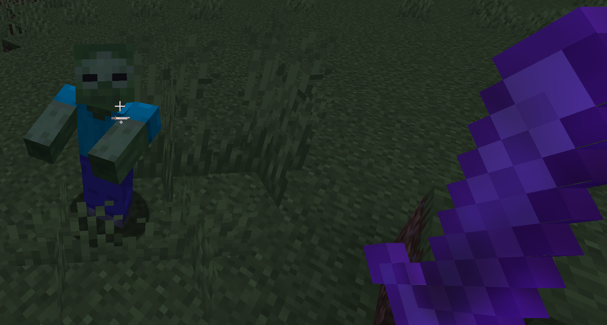

Upon killing 10 zombies, the quest will display an exclamation symbol, and the chapter will also display that symbol to signify unclaimed rewards.

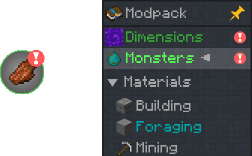

Clicking the button to collect all rewards, which is located in the top right corner, will grant us all rewards, but choice rewards.

We will be given the apples from the first quest in the "Dimensions" chapter, which was completed upon joining the world.

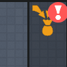
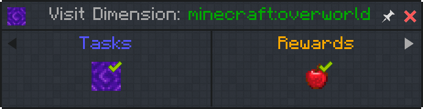
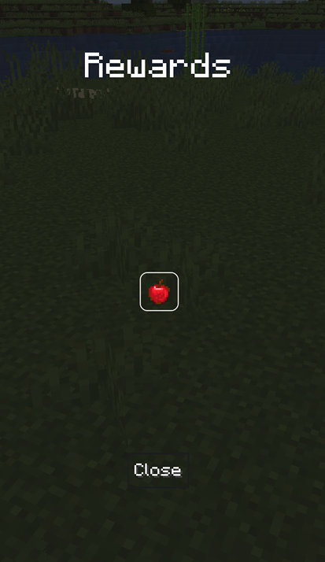

The second way to claim quest rewards is directly within the quests themselves.

We need to go into the "Monsters" chapter again and click our zombie quest to click the rewards to choose among them.

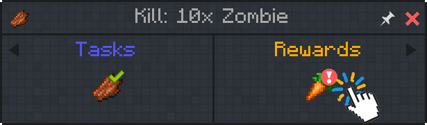

Let's click the potato to get it!

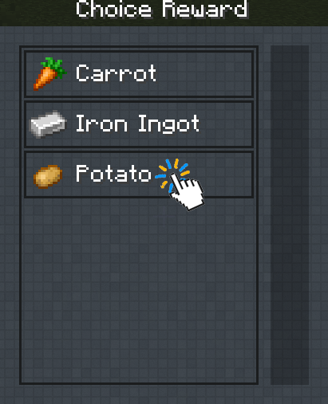

## Keeping track of progression

To continue with our progression in this demo modpack, let's jump to the Mining section since we love mining in Minecraft.

Already, the coal quest is done.

The next quest we want to tackle is the one with the raw iron icon. First, we can identify what this quest leads into by right-clicking it. This is known as the dependency lines.

Cyan and yellow paths light up, showing us that the "coal" quest is a requirement, and the "iron ingot" and the "raw gold" quests are unlocked by completing the "raw iron" quest.

|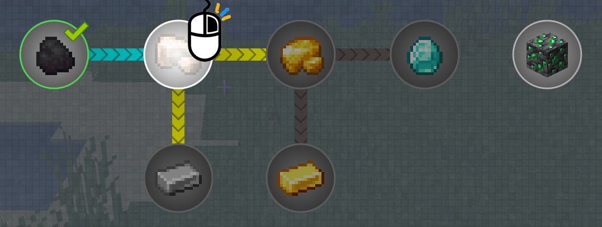|
|:-:|
|To hide dependency lines, right-click the quest once more|

Let's click the raw iron quest to enter it, and click the pin at the top right to pin it.

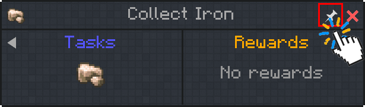

If we exit the quest by pressing :x: and then the questbook by pressing either the `Esc` key or the inventory button (`e`), then we will notice a message at the right of the screen.

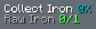

Once we collect one raw iron, the toast notification will show up and the pinned quest will go away.

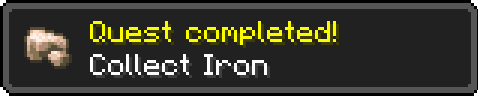

If we want to keep track of all quests available to be done, we can go back into the questbook and click the auto-pin icon in the bottom right to pin them all.

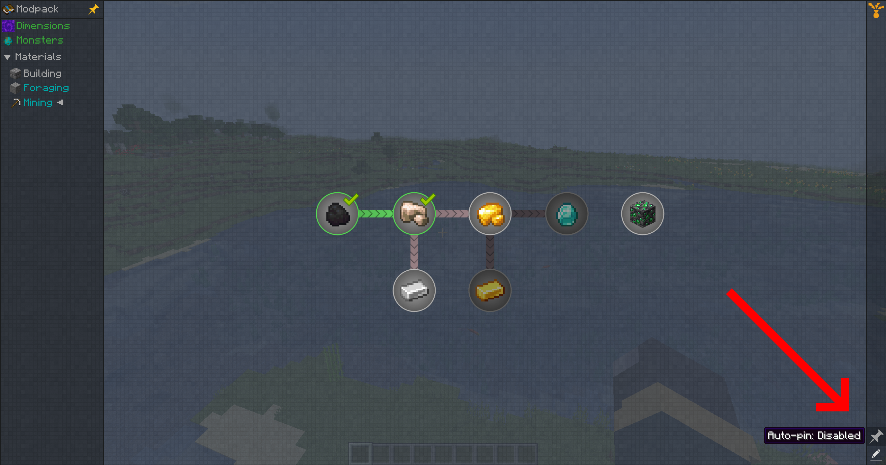

The advantage of using auto-pin instead of manually pinning quests is that the sidelist will automatically be updated with every quest completed, allowing you to assess your next target quickly.

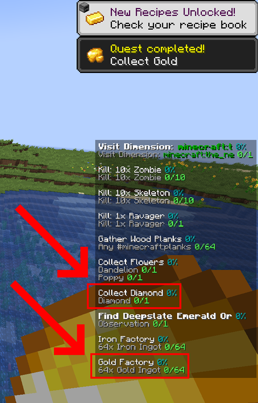

That's all folks!
