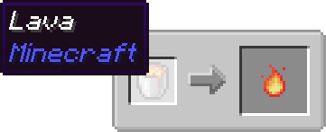
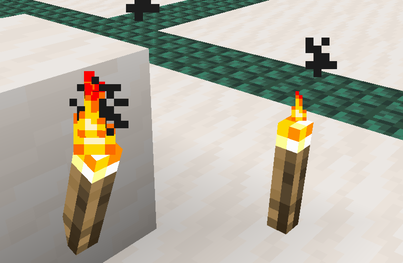
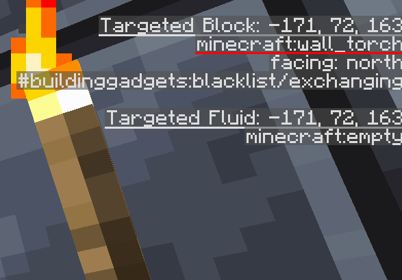
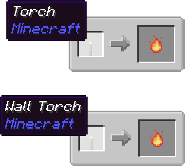

# Usage of KubeJS to add or remove recipes

FTB Jar Mod is customizable, and allows temperature sources recipes to be customized by a modpack creator through the use of [KubeJS](https://www.curseforge.com/minecraft/mc-mods/kubejs-forge). KubeJS makes it much easier to customize recipes in bulk!

:::tip Tip
In KubeJS, which uses JavaScript syntax, you can define constants which can simplify work for you. All following examples will use the full definition of function calls, without any simplification.  
At the end of this document, however, you will find all the examples in the [simplified syntax](#simplified-examples) if you wish to skip ahead.
:::

# Temperature Sources recipes

KubeJS has the option to be able to remove the built-in temperature sources recipes from the FTB Jar Mod. There are quite a few.

Here is one long way you could remove all those recipes by recipe "ID".

```js
onEvent('recipes', (event) => {
    event.remove({ id: "ftbjarmod:temperature_sources/beacon" });
    event.remove({ id: "ftbjarmod:temperature_sources/blue_ice" });
    event.remove({ id: "ftbjarmod:temperature_sources/blue_magma_block" });
    event.remove({ id: "ftbjarmod:temperature_sources/campfire" });
    event.remove({ id: "ftbjarmod:temperature_sources/creative_high" });
    event.remove({ id: "ftbjarmod:temperature_sources/creative_low" });
    event.remove({ id: "ftbjarmod:temperature_sources/creative_subzero" });
    event.remove({ id: "ftbjarmod:temperature_sources/crying_obsidian" });
    event.remove({ id: "ftbjarmod:temperature_sources/fire" });
    event.remove({ id: "ftbjarmod:temperature_sources/glowstone_block" });
    event.remove({ id: "ftbjarmod:temperature_sources/ice" });
    event.remove({ id: "ftbjarmod:temperature_sources/lava" });
    event.remove({ id: "ftbjarmod:temperature_sources/magma_block" });
    event.remove({ id: "ftbjarmod:temperature_sources/packed_ice" });
    event.remove({ id: "ftbjarmod:temperature_sources/respawn_anchor" });
    event.remove({ id: "ftbjarmod:temperature_sources/soul_campfire" });
    event.remove({ id: "ftbjarmod:temperature_sources/soul_fire" });
    event.remove({ id: "ftbjarmod:temperature_sources/torch" });
    event.remove({ id: "ftbjarmod:temperature_sources/wall_torch" });
});
```

::: warning Note
It is not possible to remove the recipe that grants the "none" temperature to [all blocks that don't specify a temperature](../contents/jars.md#blocks-with-no-temperature).
:::

Here is a much shorter way if you plan on removing all of them in any case.

```js
onEvent('recipes', (event) => {
    event.remove({type: "ftbjarmod:temperature_source"});
});
```

## Adding recipes

Here are some simple examples that add all four temperatures to some blocks.

```js
onEvent('recipes', (event) => {
    /*Adds the "none" temperature to the glowstone
    block with 25% bonus efficiency (1.25 times faster than normal)*/
    event.recipes.ftbjarmod.temperature_source({
        temperature: 'none',
        block: 'minecraft:glowstone',
        efficiency: 1.25
    });

    /*Adds the "low" temperature to the magma block
    with 50% reduced efficiency (0.5 times slower than normal)*/
    event.recipes.ftbjarmod.temperature_source({
        temperature: 'low',
        block: 'minecraft:magma_block',
        efficiency: 0.5
    });

    /*Adds the "high" temperature to the blue magma
    block with normal efficiency*/
    event.recipes.ftbjarmod.temperature_source({
        temperature: 'high',
        block: 'ftbjarmod:blue_magma_block',
        efficiency: 1.0
    });

    /*Adds the "subzero" temperature to the blue ice
    block with 300% bonus efficiency (4 times faster than normal)*/
    event.recipes.ftbjarmod.temperature_source({
        temperature: 'subzero',
        block: 'minecraft:blue_ice',
        efficiency: 4.0
    });
});
```

## Custom display

If you wish to set the display manually on the temperature source recipe, you may as well. This is particularly useful when using fluids as temperature sources for example, which don't display in item form (they use a filled bucket instead).

### Lava case

Adds lava as a temperature source, but uses the filled lava bucket as the display. Displays the text "Lava" when hovering the Lava Bucket.



```js
onEvent('recipes', (event) => {
    /*Adds the "low" temperature to the lava fluid (in-world) with
    300% bonus efficiency (4 times faster than normal)*/
    event.recipes.ftbjarmod.temperature_source({
        temperature: 'low',
        block: 'minecraft:lava',
        item: {
            item: 'minecraft:lava_bucket',
            nbt: {
                display: {
                    Name: '{"translate": "block.minecraft.lava"}',
                },
            },
        },
        efficiency: 4.0
    });
});
```

### Torch case

Some blocks have variants of themselves, like the torch, and those variants don't have an item form. For example, the torch itself standing up is called a "torch". The torch on a wall however, is called a "wall torch". There is an item called the "torch", but there is no item called "wall torch".



By placing your block in the world and looking at it while the debug screen (F3) is active will allow you to see the block name in the top right of the screen and see if this applies to a block.

|  |
|:--:|
| <figcaption>The torch placed on a wall shows a different name than when simply standing up</figcaption> |

To handle those special cases, you may need to add two separate entries.



```js
onEvent('recipes', (event) => {
    /*Adds the torch standing up as a "low" temperature source
    with 75% reduced efficiency (0.25 times slower than normal)*/
    event.recipes.ftbjarmod.temperature_source({
        temperature: 'low',
        block: 'minecraft:torch',
        item: {
            item: 'minecraft:torch',
            nbt: {
                display: {
                    Name: '{"translate": "block.minecraft.torch"}',
                },
            },
        },
        efficiency: 0.25
    });

    /*Adds the torch that is on a wall as a "low" temperature source
    with 75% reduced efficiency (0.25 times slower than normal)*/
    event.recipes.ftbjarmod.temperature_source({
        temperature: 'low',
        block: 'minecraft:wall_torch',
        item: {
            item: 'minecraft:torch',
            nbt: {
                display: {
                    Name: '{"translate": "block.minecraft.wall_torch"}',
                },
            },
        },
        efficiency: 0.25
    });
});
```

### Creative Temperature Sources

[Creative Temperature Sources](../contents/jars.md#creative-temperature-sources) don't need adjustments by default, but they also don't display in the recipe browser. You can however make them display if you want. Just like with a datapack, overriding the recipe ID will result in that recipe being modified and shown in-game.

Here is an example of the Creative High Temperature Source being added again so that it can display in-game, using its recipe ID inside the `id()` function.


```js
onEvent('recipes', (event) => {
    /*Adds the creative high temperature source as a "high" temperature source
    with 900% bonus efficiency (10 times faster than normal)*/
    event.recipes.ftbjarmod.temperature_source({
        temperature: 'high',
        block: 'ftbjarmod:creative_high_temperature_source',
        efficiency: 10.0,
    }).id('ftbjarmod:temperature_sources/creative_high');
});
```

# Simplified Examples

Below you'll find all examples from this page compiled into two example scripts. None that you might need to use only specific portions of this script for what you want to achieve.

::: details Temperature Sources recipes
```js
onEvent('recipes', (event) => {
    //Remove all temperature sources recipes by ID, one by one
    event.remove({ id: "ftbjarmod:temperature_sources/beacon" });
    event.remove({ id: "ftbjarmod:temperature_sources/blue_ice" });
    event.remove({ id: "ftbjarmod:temperature_sources/blue_magma_block" });
    event.remove({ id: "ftbjarmod:temperature_sources/campfire" });
    event.remove({ id: "ftbjarmod:temperature_sources/creative_high" });
    event.remove({ id: "ftbjarmod:temperature_sources/creative_low" });
    event.remove({ id: "ftbjarmod:temperature_sources/creative_subzero" });
    event.remove({ id: "ftbjarmod:temperature_sources/crying_obsidian" });
    event.remove({ id: "ftbjarmod:temperature_sources/fire" });
    event.remove({ id: "ftbjarmod:temperature_sources/glowstone_block" });
    event.remove({ id: "ftbjarmod:temperature_sources/ice" });
    event.remove({ id: "ftbjarmod:temperature_sources/lava" });
    event.remove({ id: "ftbjarmod:temperature_sources/magma_block" });
    event.remove({ id: "ftbjarmod:temperature_sources/packed_ice" });
    event.remove({ id: "ftbjarmod:temperature_sources/respawn_anchor" });
    event.remove({ id: "ftbjarmod:temperature_sources/soul_campfire" });
    event.remove({ id: "ftbjarmod:temperature_sources/soul_fire" });
    event.remove({ id: "ftbjarmod:temperature_sources/torch" });
    event.remove({ id: "ftbjarmod:temperature_sources/wall_torch" });

    //Remove all temperatures sources in one line, equivalent to above
    event.remove({ type: "ftbjarmod:temperature_source" });

    //Define a function that can add a normal temperature source
    const source = (temperature, block, efficiency) => {
        event.recipes.ftbjarmod.temperature_source({
            temperature: temperature,
            block: block,
            efficiency: efficiency,
        });
    };

    //Define a function that can add a temperature source with custom item display
    const sourceWithItem = (temperature, block, efficiency, item) => {
        event.recipes.ftbjarmod.temperature_source({
            temperature: temperature,
            block: block,
            item: item,
            efficiency: efficiency,
        });
    };

    /*Adds the "none" temperature to the Glowstone
    block with 25% bonus efficiency (1.25 times faster than normal)*/
    source('none', 'minecraft:glowstone', 1.25);

    /*Adds the "low" temperature to the Magma Block
    with 50% reduced efficiency (0.5 times slower than normal)*/
    source('low', 'minecraft:magma_block', 0.5);

    /*Adds the "high" temperature to the Blue Magma
    Block with normal efficiency*/
    source('high', 'ftbjarmod:blue_magma_block', 1.0);

    /*Adds the "subzero" temperature to the Blue Ice
    block with 300% bonus efficiency (4 times faster than normal)*/
    source('subzero', 'minecraft:blue_ice', 4.0);

    /*Adds the "low" temperature to the lava fluid (in-world) with
    300% bonus efficiency (4 times faster than normal)*/
    sourceWithItem('low', 'minecraft:lava', 4.0,
        { item: 'minecraft:lava_bucket', nbt: { display: { Name: '{"translate": "block.minecraft.lava"}' } } }
    );

    /*Adds the torch standing up as a "low" temperature source
    with 75% reduced efficiency (0.25 times slower than normal)*/
    sourceWithItem('low', 'minecraft:torch', 0.25,
        { item: 'minecraft:torch', nbt: { display: { Name: '{"translate": "block.minecraft.torch"}' } } }
    );

    /*Adds the torch that is on a wall as a "low" temperature source
    with 75% reduced efficiency (0.25 times slower than normal)*/
    sourceWithItem('low', 'minecraft:wall_torch', 0.25,
        { item: 'minecraft:torch', nbt: { display: { Name: '{"translate": "block.minecraft.wall_torch"}' } } }
    );

    /*Adds the creative high temperature source as a "high" temperature source
    with 900% bonus efficiency (10 times faster than normal)*/
    /*If you want to use .id() you need to use this format, or add an
    extra parameter to the .source() function as follows: */
    // const sourceWithID = (temperature, block, efficiency, recipeID) => {
    //     event.recipes.ftbjarmod.temperature_source({
    //         temperature: temperature,
    //         block: block,
    //         efficiency: efficiency,
    //     }).id(recipeID);
    // };
    //
    //sourceWithID('high', 'ftbjarmod:creative_high_temperature_source', 10.0, 'ftbjarmod:temperature_sources/creative_high');
    event.recipes.ftbjarmod.temperature_source({
        temperature: 'high',
        block: 'ftbjarmod:creative_high_temperature_source',
        efficiency: 10.0,
    }).id('ftbjarmod:temperature_sources/creative_high');
});
```
:::