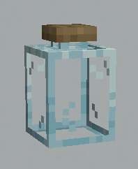
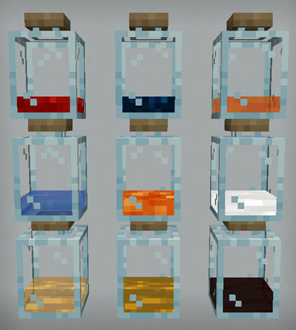
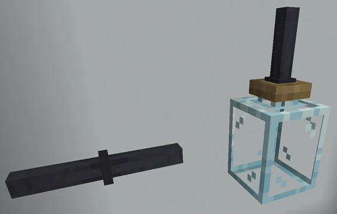
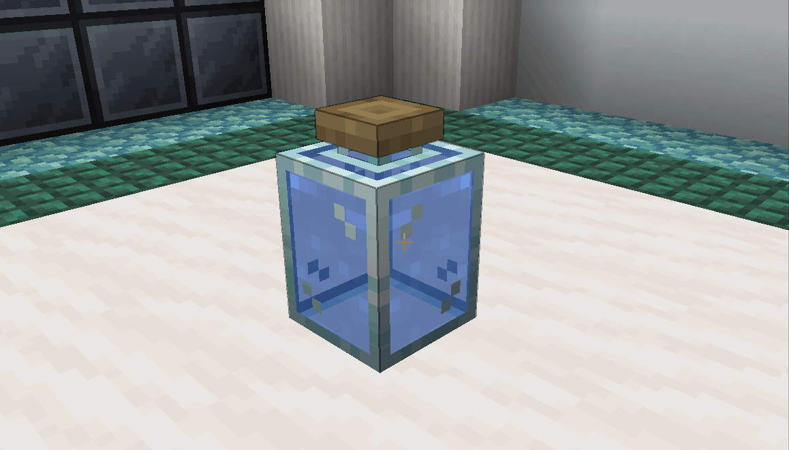

# Glass Jar

Glass Jars are transparent containers that can hold liquid and supply it to recipes in the FTB Jar Mod. The cork of the Glass Jar is made out of cork.

The fluid they can hold can be hot, cold, or even come from mods! They will not break, even if lava is placed inside them. Each Glass Jar can contain up to 8 buckets (8000 mb) of fluid.

Glass Jars will only connect to Iron Cast Tubes at their top, not at their sides or bottom. Fluid containers from other mods don't have this restriction however.

Glass Jars do not retain their contents when broken. They really are meant only for providing fluids for crafting!

