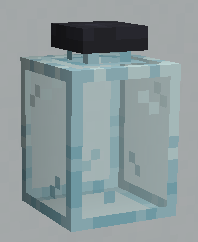
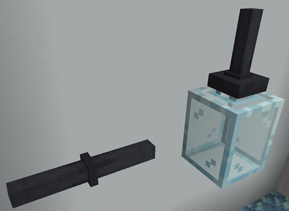
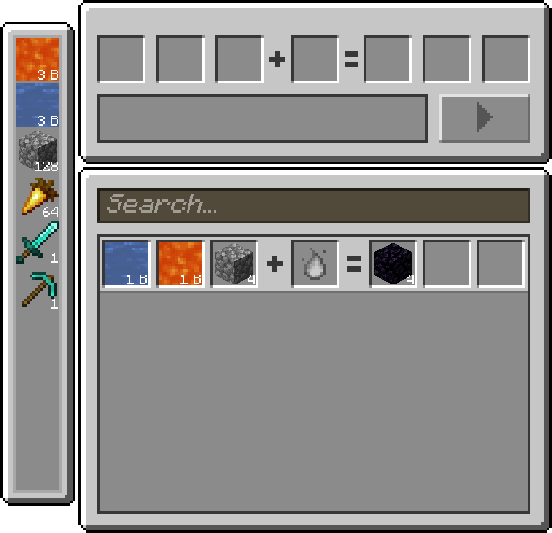
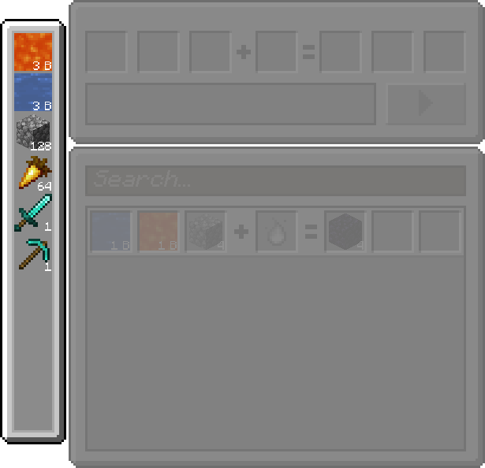
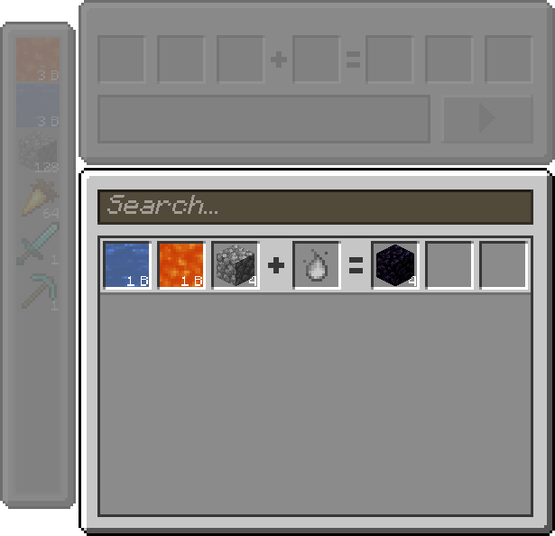
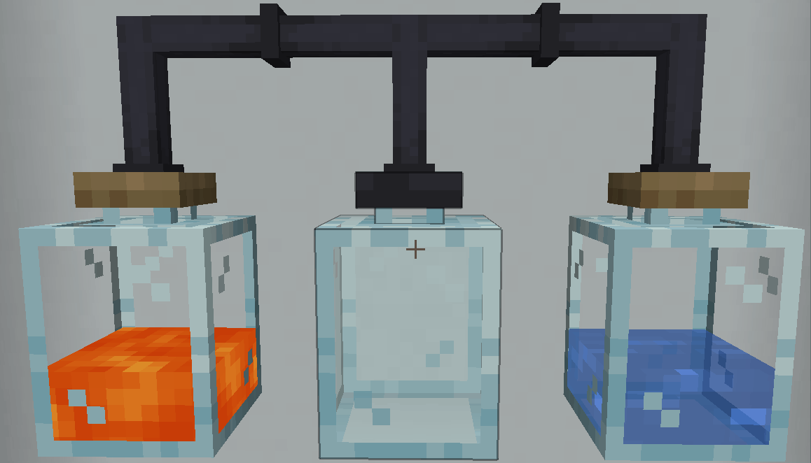
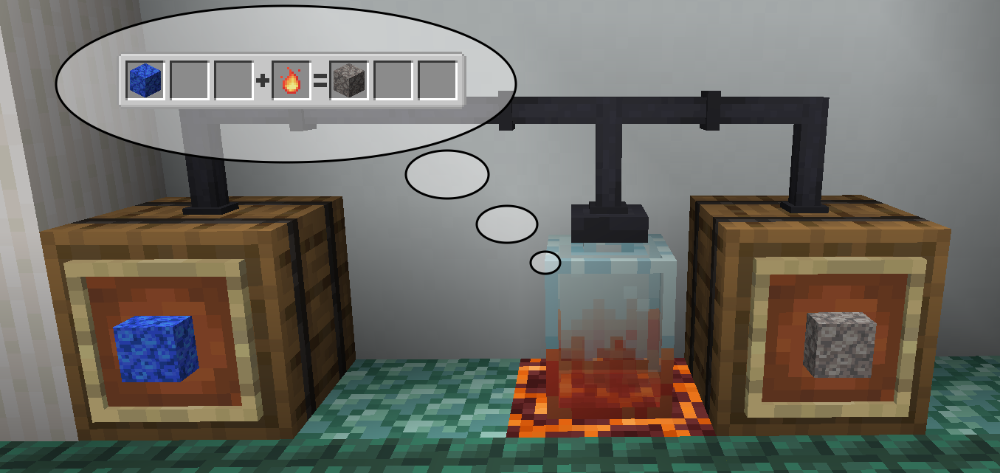

# Tempered Glass Jar

Tempered Glass Jars are used to craft in the FTB Jar Mod.

Tempered Glass Jars are transparent jars, but they differ in appearance and function to [Glass Jars](./glass-jars.md). The glass is more foggy, and the cork is made out of metal instead. Tempered Glass Jars cannot hold any fluids.

Tempered Glass Jars, like [Glass Jars](./glass-jars.md), also connect to Iron Cast Tubes only at the top where the cork is.

To start crafting recipes, you need to connect a Tempered Glass Jar to chests or other filled [Glass Jars](./glass-jars.md). For example, you could have this setup:

If you use the Tempered Glass Jar, you will be shown a menu in order to be able to craft.

By default no recipes are added by the mod, but for the sake of this example, we added a recipe to make obsidian that uses 1 bucket of lava, 1 bucket of water and 4 cobblestone.

In the left part of the menu, you will have a short list of some of your available inventory items and fluids for the recipes. This will also show materials in connected chests and fluids in connected [Glass Jars](./glass-jars.md).

In the bottom-right part of the interface is where recipes will be shown to you and where you can select them.

In the top-right part of the interface, which is currently empty, will allow you to craft a selected recipe.

The Tempered Glass Jar will detect items in the player inventory, in connected chests and fluids in connected [Glass Jars](./glass-jars.md). Here is an example that shows how you can craft a recipe by using the Tempered Glass Jar.

Here, the player is holding the necessary items directly inside the inventory.

## Output behavior

The Tempered Glass Jar will output to the nearest item or fluid container it can find. If you wish to separate your input from the output, you can put the input item or fluid containers further away from the output ones.

|  |
|:--:|
| The tube coral block is inputted from the left barrel, and the dead tube coral block is outputted to the barrel on the right in the [drying coral block](../KubeJS-integration/tempered-glass-jar-recipes.md#drying-a-coral-block-with-low-temperature) recipe. |

If all possible inputs and outputs are full and a recipe is being processed, the resulting items will be ejected into the world.

In the case of fluids, they will be ejected as a special item, the fluid container item.

|  |
|:--:|
| The [cobblestone to lava](../KubeJS-integration/tempered-glass-jar-recipes.md#cobblestone-to-lava-under-high-temperature) recipe cannot output to the [Glass Jar](./glass-jars.md) nor the barrel because they are both full, so a fluid container item is created in the world instead. |
