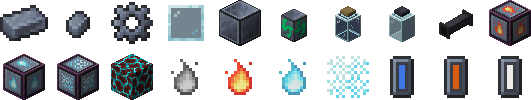
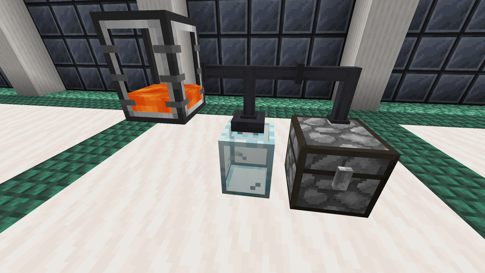

# FTB Jar Mod

FTB Jar Mod is a mod that was made primarily made for the modpack **FTB OceanBlock**. It features glass jars and tubes as a crafting mechanic to allow the player to craft more advanced blocks or items.

[Tempered Glass Jars](./contents/tempered-glass-jars.md) are used to craft, and some cast iron tubes will connect [Glass Jars](./contents/glass-jars.md) and inventories to them to provide materials for the crafts.

|  |
|:--:|
| [Tempered Glass Jars](./contents/tempered-glass-jars.md) are recognizable by their metal corks |

Other inventories are also supported, such as modded fluid or item containers.

[Tempered Glass Jars](./contents/tempered-glass-jars.md) require a certain [temperature](./contents/temperature.md) to operate, depending on the recipe. Some default temperatures are added to blocks.

The crafting of some recipes using [Tempered Glass Jars](./contents/tempered-glass-jars.md) can be automated using a [Jar Auto-Processing Block](./contents/automation.md).

The mod does not add recipes in [Tempered Glass Jars](./contents/tempered-glass-jars.md) by default, but you can add your own either with the KubeJS integration the mod possesses or with a datapack relatively easily. You can also add or remove [temperature](./contents/temperature.md) sources that way as well.
