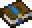
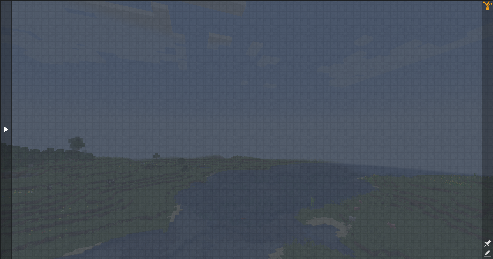
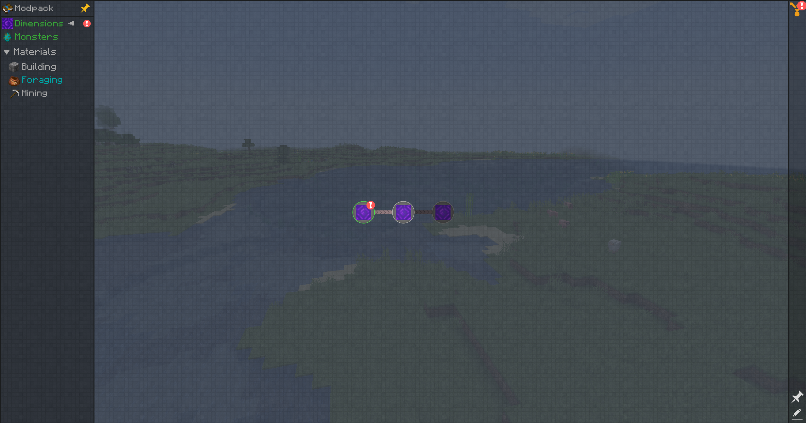
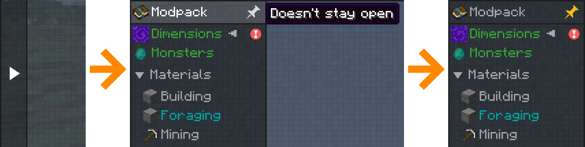

# Usage of the questbook in FTB Quests

The questbook is an item in the FTB Quests mod. Upon being opened with the use button, the questbook displays a user view of some quests. If the player is not playing in a modpack that was designed with quests, the questbook will be empty.

|  |
|:--:|
| An empty questbook, because the modpack did not have any. |

In progression style modpacks however, the questbook may be filled with chapters and quests for the player to complete.

|  |
|:--:|
| A questbook filled with a few chapters and quests. |

## General navigation

Upon sliding the cursor to the left of the window, onto the arrow, the view will expand and you see all available chapters in a made progression modpack. You will also be able to pin that tab if you want, using the pin icon at the top.

