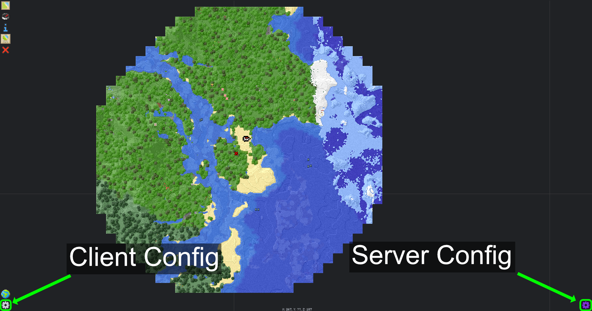
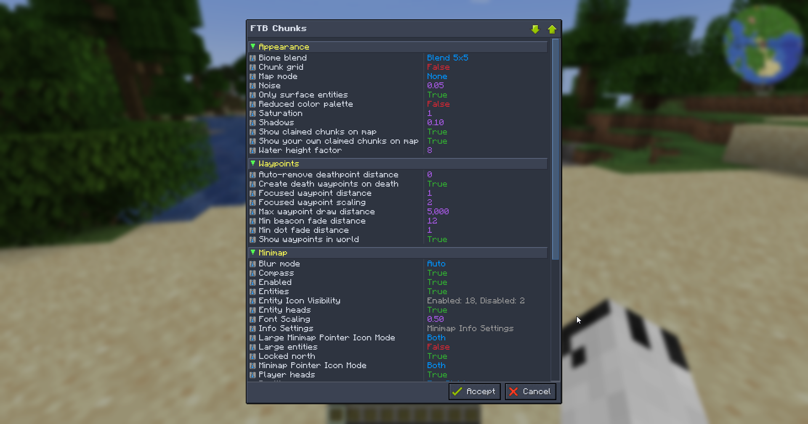

## Overview

FTB Chunks comes with 2 configuration files, one for the server and one for the client. Both files are located in the config folder of your Minecraft instance `<instance>/config/ftbchunks-(client/server).snbt`

These 2 config files can be overridden on modpack updates so it also possible to locally overwrite these configs by making a copy `ftbchunks-client.snbt` to `<instance>/local/ftbchunks-client.snbt` and for the client and for the server copy `ftbchunks-world.snbt` to `<instance>/world/serverconfig/ftbchunks-world.snbt`

The config file is heavily-commented, so each individual subsection will not be documented here.

## Editing the config

It's possible to edit the config for both client and server in-game by opening the FTB Chunks map (<kbd>M</kbd> by default) then to edit the client config click on the gear icon in the bottom left corner of the map, and to edit the server config click on the purple gear icon in the bottom right corner of the map.

This will open a GUI where you can edit the config values, to get a description of the config value hover over the config value and a tooltip will show up with a description of the config value. After you have edited the config values click on the Accept button in the bottom right corner of the GUI to save the config values.

If you prefer to edit the config files manually you can do so by opening the config files in a text editor. The config files are in a SNBT format, which is a human-readable format that is easy to edit and located in the folders mentioned above
