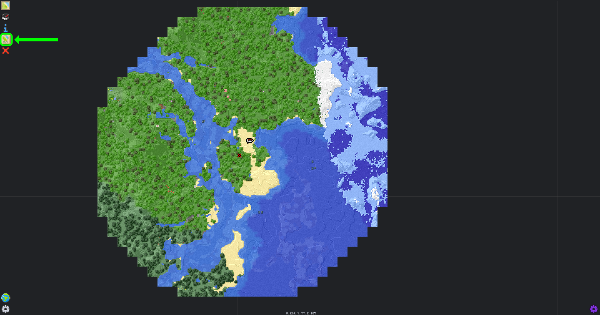
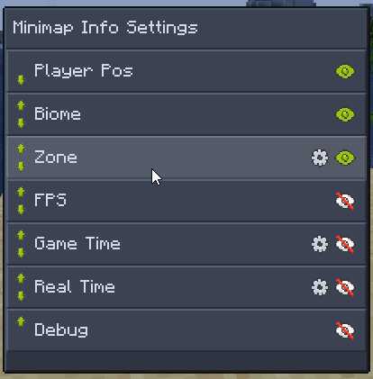

## Overview
FTB Chunks comes with a mini map and a fullscreen map that allows you to see the world around you, it also allows you to create waypoints to mark locations in the world, and teleport to them.

The mini map is enabled by default and can be expanded to the fullscreen map by pressing <kbd>M</kbd> by default, a keyboard/mouse reference can be seen by clicking on the blue `i` icon while on the fullscreen map.

## Mini map
The mini map is displayed in the top right corner of the screen by default.

### Configuring the mini map
The mini map can be configured by clicking on the gear icon in the bottom left corner of the fullscreen map, this will open a GUI where you can configure the mini map settings.
For a guide on finding the in game config see [Configuring FTB Chunks](./config.md#editing-the-config).

All the minimap settings will be in its own section in the config GUI, for a description of what each setting does hover over the setting and a tooltip will show up with a description of the setting.

### Minimap display info
Extra information can be displayed under the minimap by clicking on the Minimap Info Settings when on the fullscreen map, this will open a GUI where you can configure the minimap info settings.

This allows you to display extra information under the minimap, such as the current biome, coordinates, current time of day and FPS

