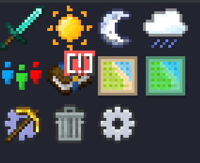

## What is FTB Library?

FTB Library is one of our core mods / library mod that is a collection of common code, utilities, and features that are utilized across all of our mods. 

## Features

- `SNBT`, our custom string based NBT format that is used by our config system and by most of our storage solutions for mod data. See [SNBT](/docs/mods/technical/SNBT/) for more information.
- `Custom UI` system that is used to create GUI's in all of our mods
- `Sidebar System` that is used to dynamically create sidebar icons for quick access for the user. This can do an array of different things, primarily run commands, open GUI's, or open a URL.
- `Config system` that is used to create and manage config files for mods. This system is used by all of our mods to create and manage their config files.
- `Utility commands` such as `/ftblibrary rain`, `ftblibrary night`, etc.

## Commands

| Command | Description |
| --- | --- |
| `/ftblibrary gamemode` | Quick toggle between creative and survival |
| `/ftblibrary rain` | Toggle rain |
| `/ftblibrary day` | Set time to day |
| `/ftblibrary night` | Set time to night |
| `/ftblibrary clientconfig` | Opens the client config |
| `/ftblibrary nbtedit <block\|entity\|item\|player>` | Opens a rich NBT Editing GUI |

## NBT Editor

The NBT Editor is a powerful tool that allows you to edit NBT data in a user-friendly way. You can edit the NBT data of blocks, entities, items, and players. The NBT Editor is accessible in-game by running the `/ftblibrary nbtedit` command.

## Sidebar System

The Sidebar System can be used to display a dynamic array of buttons on the inventory screen as shortcuts for the user. Many FTB Mods add one or more buttons to the sidebar by default.

Players can edit the position and visibility of the buttons by right-clicking on one of them to enter edit mode. The sidebar can be disabled entirely in `/ftblibrary clientconfig` if desired. Modpack Creators can edit the default setup of the sidebar by editing `defaultconfig/ftblibrary-client.snbt`.

Non-FTB Mods can add support for a sidebar button via a json asset file. The supported features are subject to change, but here are some references: [JSON Schema](https://github.com/FTBTeam/FTB-Library/blob/dev/common/src/main/java/dev/ftb/mods/ftblibrary/sidebar/SidebarButtonData.java#L26). [Click Event Translation](https://github.com/FTBTeam/FTB-Library/blob/dev/common/src/main/java/dev/ftb/mods/ftblibrary/util/client/ClientUtils.java#L67). [Example Button JSON](https://github.com/FTBTeam/FTB-Library/blob/dev/common/src/main/resources/assets/ftblibrary/sidebar_buttons/toggle/day.json)
