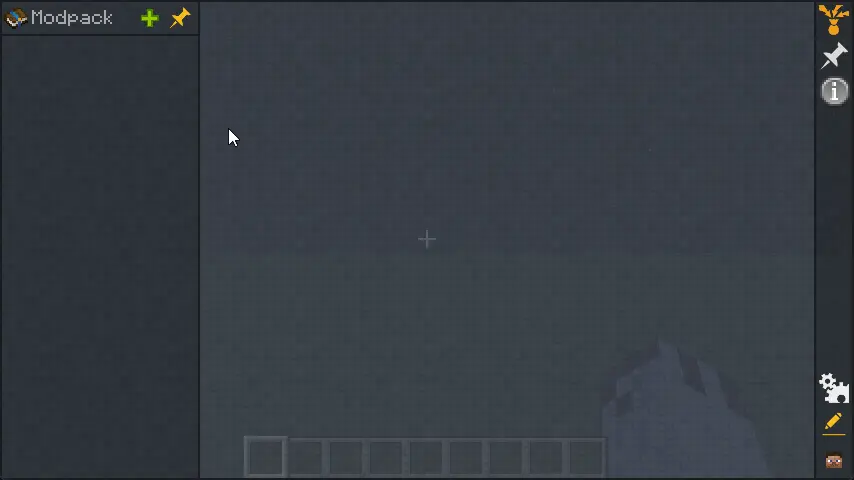
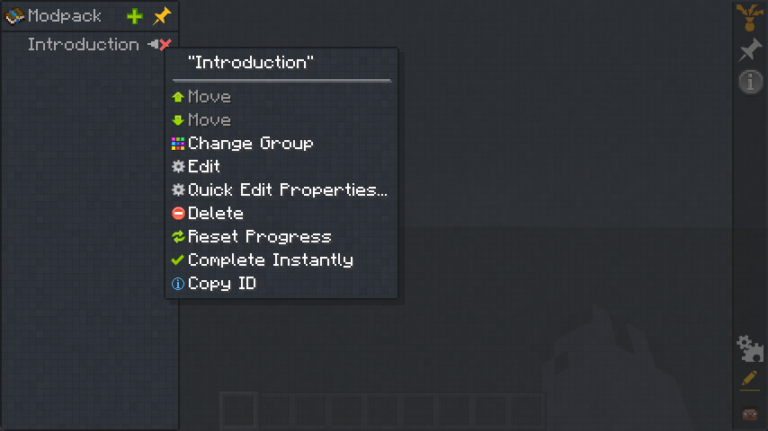
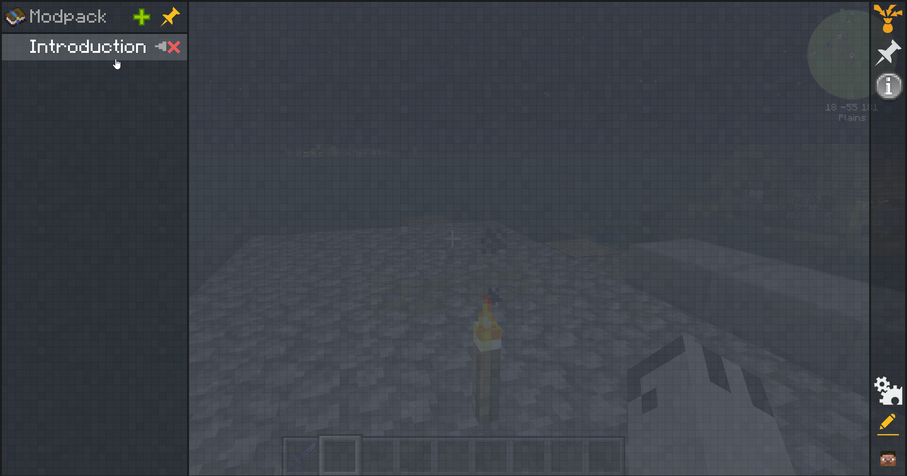

## Creating Chapters

To create a chapter, expand the sidebar on the left and click on the green `+` button, this will open a menu where you can either create a new chapter or chapter group.

A chapter group is a way to organize your chapters into categories, for example, you could have a chapter group called "Introduction" and then have all of your introductory chapters inside that group.

Once the chapter is created, you can right-click on it to open the chapter options menu where you can choose to move the chapter up or down and edit the chapter settings.

## Editing Chapter Settings

When you click on the edit button in the chapter options menu, you will be taken to the chapter settings screen where you can change the chapter title, icon and much more.

A description of each setting can be read by hovering over the options

A full list of settings can be found on the [Chapter Settings](./Settings.md) page.
