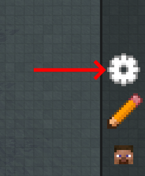
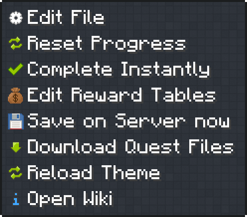
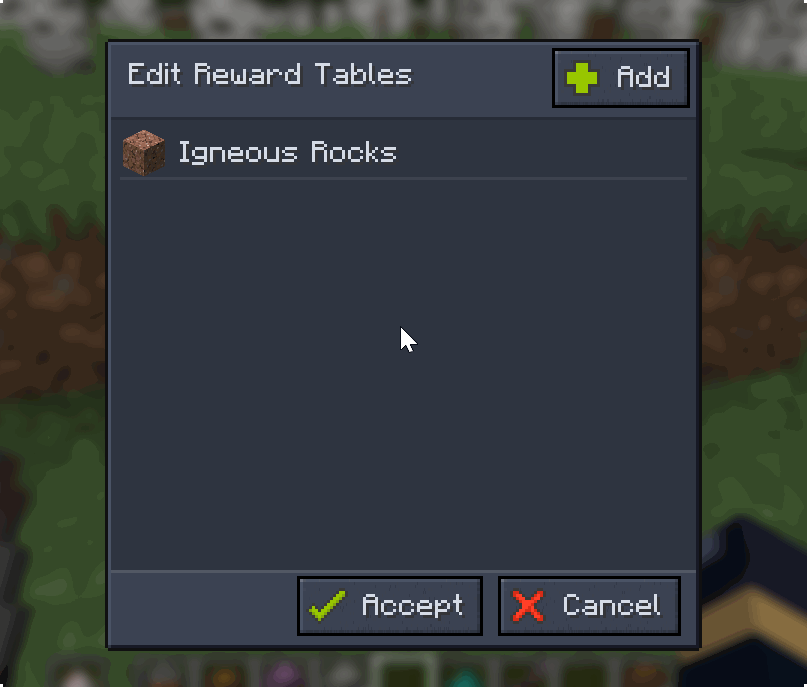
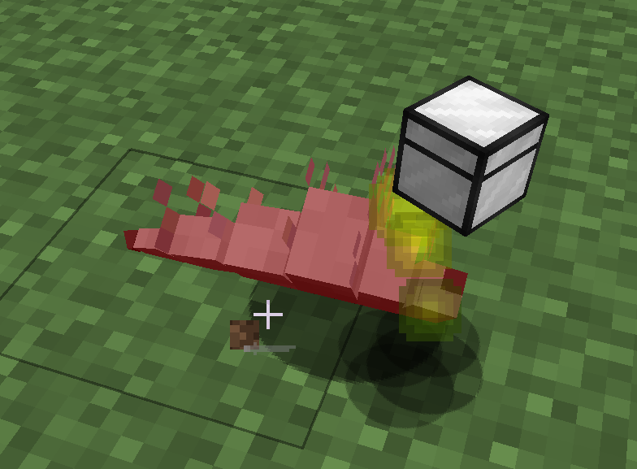
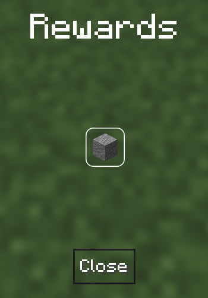
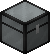

# Reward Tables

Reward Tables are a way to manage quest rewards dynamically, equivalent to [loot tables](https://minecraft.wiki/w/Loot_table).

## Accessing reward tables

Instead of assigning a fixed reward, you create a pool of items that the reward will be selected from.

Click the settings cog in your questbook (lower right).



Select "Edit Reward Tables" in the menu, where you'll be taken to create your first reward table.



## Types of loot tables

Within the questbook interface, reward tables are created and categorized into various types, which are detailed on the [quest rewards](./Rewards/index.md) page.

- Choice Reward
- All Table Reward
- Random Reward
- Loot Reward

## Loot crates

Loot crates are loot boxes that reward the player with a **Random Reward** upon their use. They keep all the benefits offered by reward tables.

### Converting a reward table

After a reward table is created, it can be converted to a loot crate by hovering over it and clicking the loot crate button.

In the following image, we convert a reward table of igneous rocks to a loot crate.



### Obtaining the crate as an item

To obtain the crate as an item in-game, you must know its identifier (id). In the previous example, the id was `igneous_rocks`.


:::info
Minecraft 1.20.5 and above use the new [component](https://minecraft.wiki/w/Data_component_format) item system when giving items.
:::

```mcfunction
/give @s ftbquests:lootcrate[ftbquests:loot_crate="igneous_rocks"]
```

### In a loot table

Loot crates in item form can be included in a standard Minecraft [loot table](https://minecraft.wiki/w/Loot_table). We'll go through an example.

With the following structure, we create a [datapack](https://minecraft.wiki/w/Data_pack) named `SilverfishLootCrateDatapack` in our world folder.

```plaintext
world/
└── datapacks/
    └── SilverfishLootCrateDatapack/
        ├── pack.mcmeta <----------------------- Mandatory file for datapacks
        └── data/
            └── minecraft/
                └── loot_tables/
                    └── entities/
                        └── silverfish.json <--- The silverfish loot table
```

- [pack.mcmeta](https://minecraft.wiki/w/Data_pack#pack.mcmeta) is mandatory and includes your datapack version.
- The file `silverfish.json` includes your loot table which contains a loot crate.

In the following code block is the code for the loot table. Notice the use of the component `ftbquests:loot_crate` with the id of our loot crate, `igneous_rocks`, to clearly identify this loot crate's contents.

```json
{
  "type": "minecraft:entity",
  "pools": [
    {
      "rolls": 1,
      "entries": [
        {
          "type": "minecraft:item",
          "name": "ftbquests:lootcrate",
          "functions": [
            {
              "function": "minecraft:set_components",
              "components": {
                "ftbquests:loot_crate": "igneous_rocks"
              }
            }
          ]
        }
      ]
    }
  ],
  "random_sequence": "minecraft:entities/silverfish"
}
```

After saving our `silverfish.json` file, we exit the world and enter it again. Now, silverfish will drop our "Igneous Rocks" loot crate on death.



When we will open the loot crate from the silverfish, we will obtain either one Granite, Diorite or Andesite.



### Presets to accelerate development

A few presets can help you create loot crates of various rarities quickly.

By creating a reward table with any name in the "Name" column below (e.g. "`common`"), and converting it to a loot crate, it will automatically assign some properties.

|Icon|Name|Color (hexcode)|Passive Mob Drop Rate|Monster Drop Rate|Boss Drop Rate|Glow|
|-|-|-|-|-|-|-|
||common|0x92999A|350|10|0|false|
||uncommon|0x37AA69|200|90|0|false|
||rare|0x0094FF|50|200|0|false|
||epic|0x8000FF|9|10|10|false|
||legendary|0xFFC147|1|1|190|true|
