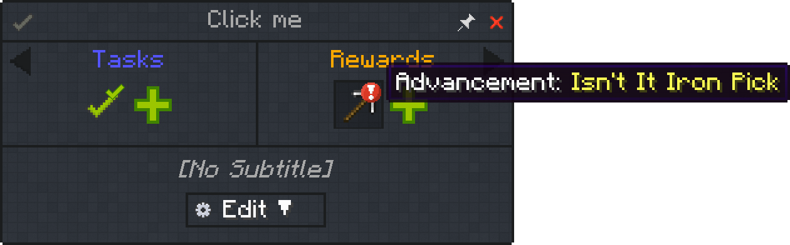
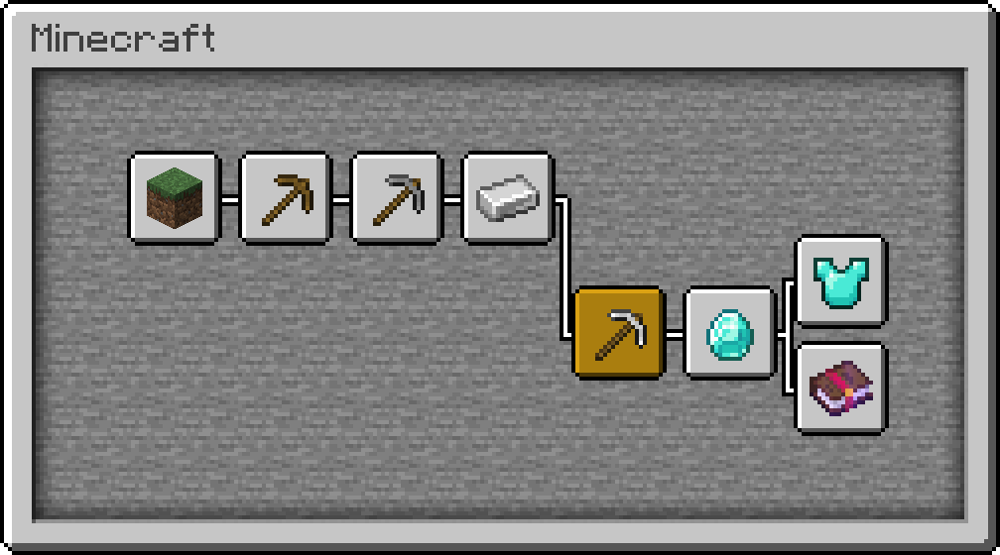

# Advancement Reward

Advancements are a means to track progression in Minecraft, but sometimes you can use them for custom logic or even to give out items.

## Example

To grant a specific advancement through a quest, create the reward for it and select your advancement to grant.

In this example we want to grant the "Isn't It Iron Pick" advancement.

Only this advancement (in yellow) will be granted to the player. Dependencies until that advancement are untouched.

:::tip
If you want to grant all advancements until "Isn't It Iron Pick", you might be better off with a [command reward](./Command_Reward.md) such as `/advancement grant @p until minecraft:story/iron_tools`.
:::
