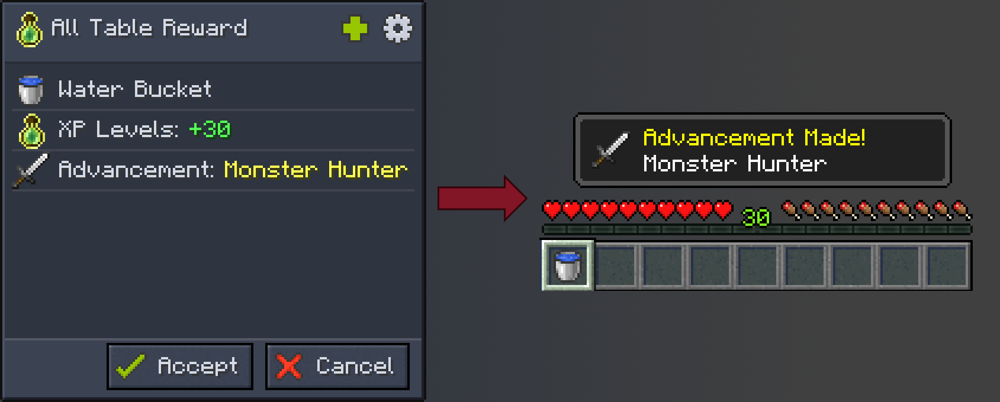

# All Table Reward

All rewards of a specific reward table will be given out to the player, in full count.

For example, if we have a reward table with many rewards such as items, xp, advancements, etc., the player will receive all of them at once.

