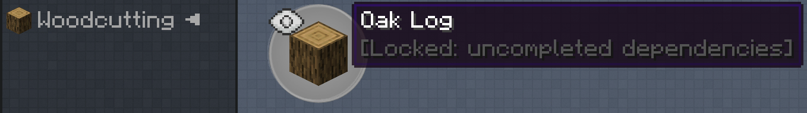
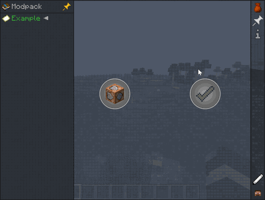

# Command Reward

With a command reward, you can almost do anything. You input the command in the reward itself.

Example: Teleport the player five blocks up (requires permission level 2, also set in the reward itself)

```mcfunction
/tp @p ~ ~5 ~
```

Example: Add 10 levels to the player (requires permission level 2)

```mcfunction
/xp add @p 10 levels
```

Etc. Try something now!

## Changing quest progress on the go

Running commands such as from `/ftbquests` is also possible.

For example we have a dummy quest with the quest id `570F25BE1914AE96`. We change its settings to be hidden in the questbook.


We also have a special chapter "Woodcutting" with one quest called "Oak Log".

"Oak Log" is dependent on the completion of "Dummy Quest" before it can show up, since we set it as hidden until dependencies are completed. The chapter "Woodcutting" is also hidden since we set the same setting and "Oak Log" is our only quest.



When you are rewarded with the command `/ftbquests change_progress @p complete 570F25BE1914AE96` (permission level 2 required in the settings), you will complete this hidden dummy quest.

By this chain of events you then unlock the "Oak Log" quest and its "Woodcutting" chapter.

Here's an example of this in action:



With this method you have more granular control over quest progression and can give your players some choices.
