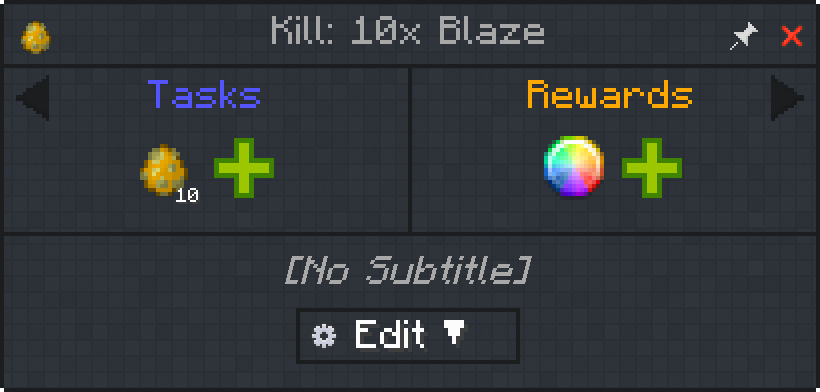
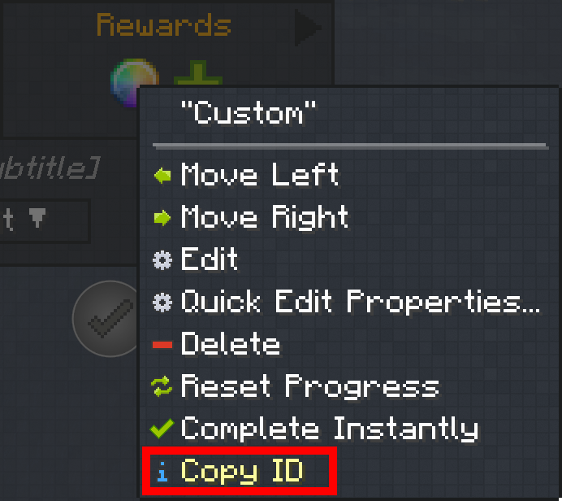
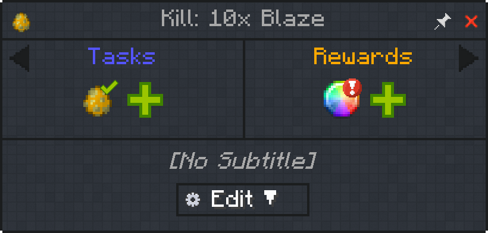
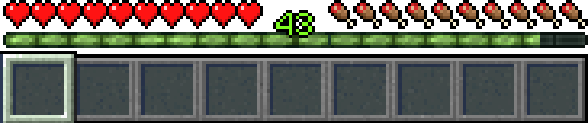
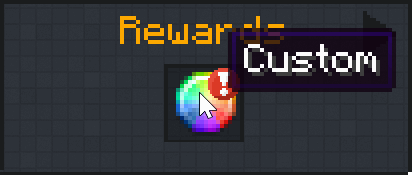
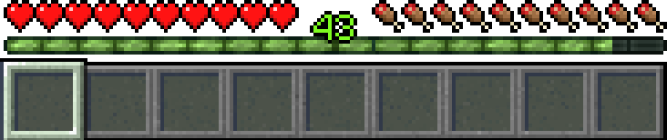

# Custom Reward

Custom quests do nothing on their own. When they are paired with mods such as KubeJS that integrate with Architectury events (a library mod), they allow for complex rewards.

:::note
The mods KubeJS and FTB XMod Compat are usually required to write custom rewards.
:::

## Usage

Custom rewards are best used after trying other built-in options of FTB Quests. Think of custom rewards like minecraft functions (mcfunction). They'll allow you to do complex calculations for your reward giving.

Let's imagine a two steps operation where you want to give your players an amount of diamonds equal to their experience level.

1. Count the experience levels
2. Give diamonds equal to said experience level

### Diamonds equal to XP level example

First, let's create a quest to kill 10 Blaze for a custom reward.



Let's then copy the custom reward ID by right-clicking it. In this example our ID for this custom reward is `29F9C17B7503E992`.



:::note
For this example, we have KubeJS and FTB XMod Compat installed since they are both required.
:::

We create a script at the location `kubejs/server_scripts/custom.js` under our modpack's root folder with the following content.

```javascript
//Minecraft 1.21.1
//For the blaze quest, give player diamonds equal to xp level
FTBQuestsEvents.customReward('29F9C17B7503E992', event => {
    const xpLevel = event.player.experienceLevel
    const diamonds = Item.of('minecraft:diamond', xpLevel)
    event.player.give(diamonds)
})
```

Then in-game we reload the server scripts with `/kubejs reload server-scripts` and we go kill 10 blaze (or forcefully complete the quest for testing purposes).



We now take a look at our xp bar: we are level 43, so we should expect to receive 43 diamonds.



We click the reward to collect it. This will execute the KubeJS script on the server and run the JavaScript code from earlier.



We are then given diamonds equal to our experience level, in this case, 43 diamonds.



Making custom rewards work can sometimes be more time consuming than other reward giving methods, but when used properly it can empower your creativity as a maker.
