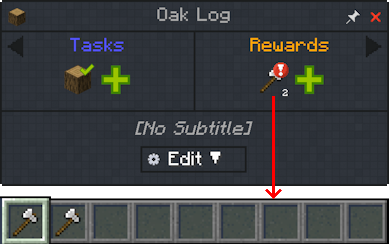
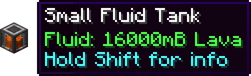
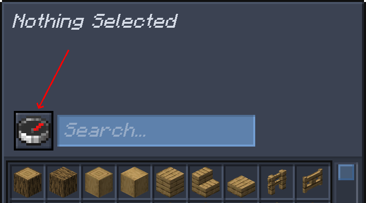
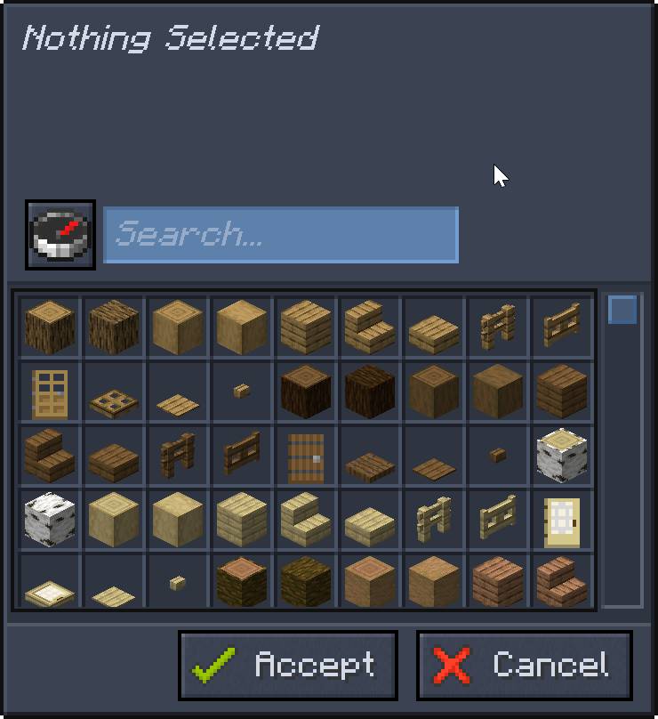

# Item Reward

## Receiving the item

When the player finishes the quest with an item reward, they will be given an item or a count of an item (by default).

For example here clicking the axe icon rewards two identical axes.

## Rewarding with fluids or other custom data

The easiest way is to put the item with the fluids **in your inventory**.

For example we fill a small fluid tank from PneumaticCraft with lava.

When selecting for the item to reward the player with, we will click the compass to change the mode.

Then, we can select our fluid tank to give as a reward.

