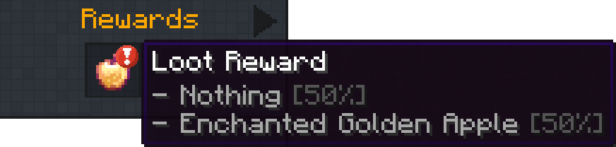

# Loot Reward

The loot reward is your standard loot table. There's a chance to receive one of the rewards, or nothing.

## Example with an apple

In this loot table, we have a single enchanted golden apple.

The weights are as follows:

- 1 for the enchanted golden apple
- 1 as the configured empty weight for this table (cog icon)

Since both the apple and the empty weight have the same value, they have the same chance of being obtained.

Therefore, the player could end up with absolutely nothing, which we can see below.

Unless you want to reward players with nothing, avoid setting the empty weight above zero!
