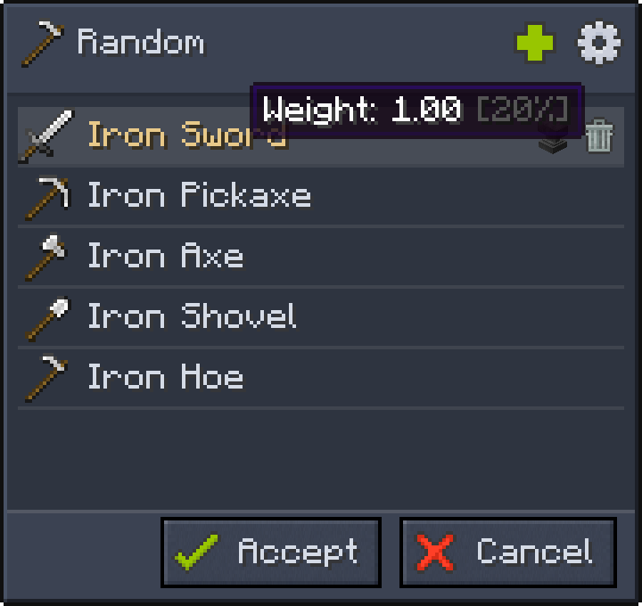

# Random Reward

A random reward pulls one entry from a reward table and gives it to the player in **full count**. An item is **always guaranteed**.

In the example below, it's guaranteed to get any of the five tools, with a 20% chance of getting a sword.

:::info
Even if the reward table's empty weight is greater than zero, the player will always receive an item.
:::

## Empty pockets

Want a chance to reward nothing? See [Loot Reward](./Loot_Reward.md) instead.
