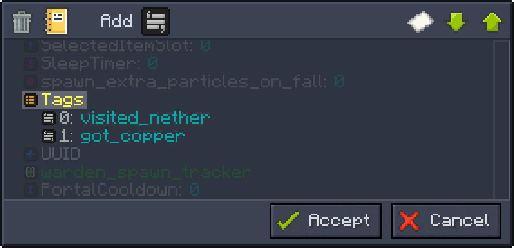
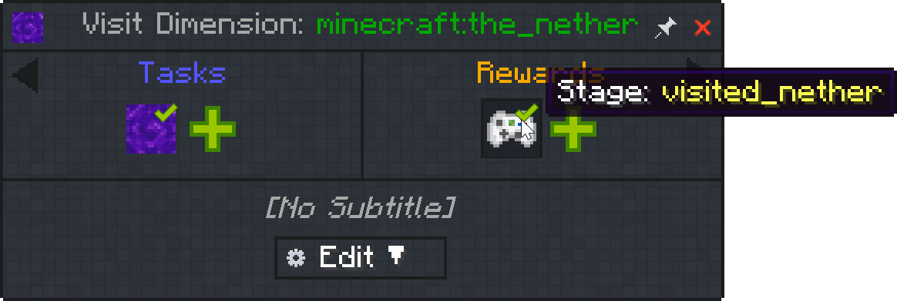
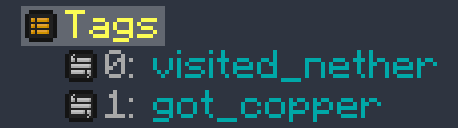
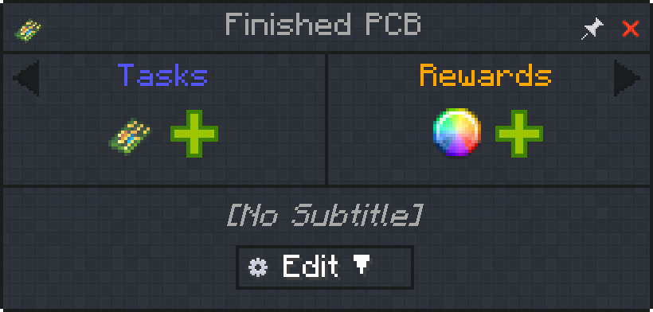
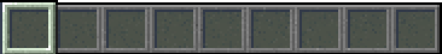

# Stage Reward

Stage rewards add or remove stages to a player which are usually tied in with modpack progression. How these stages are added depends on your installed mods.

## Stage provider

Stages are fully handled by FTB Library.

By default, FTB Library allows any gamestage mod to replace the implementation of stages. This means if you have a gamestage mod installed, refer to that mod's documentation.

Instead if you are only using a stock install of FTB Quests along with FTB Library, stages are implemented as tags onto your player.

To see those tags, you can use the command `/ftblibrary nbtedit player @s`. Here's a visual example where a player both visited the nether and got copper.



## Stock demonstration with KubeJS

If you only plan on using FTB Quests for progression, let's take a look at how you can implement it. For this example we'll be using KubeJS to manipulate the stage tags.

We create a quest for our player to visit the nether and they manage to do so, automatically receiving the stage upon entering the hellish dimension.



Using `/ftblibrary nbtedit player @s` we confirm that they got the tag `visited_nether`. We also notice they possessed the `got_copper` tag beforehand.



Next we create a quest to get a PneumaticCraft "Finished PCB" item which rewards the player with a custom reward.

We copy the ID of this custom reward which for our example is `082B2A8F0870DB9E`.



:::tip
Check the [custom reward](./Custom_Reward.md) page for more in-depth information on this reward type.
:::

Under our modpack's root, we create the following script at the location `kubejs/server_scripts/stages.js`.

Then, reload the server scripts with `/kubejs reload server-scripts`.

```javascript
// Minecraft 1.21
// The reward granted for the "Finished PCB" quest
FTBQuestsEvents.customReward('082B2A8F0870DB9E', event => {
    const playerStages = event.player.stages

    const give_diamond = function(amount) {
        const diamond_items = Item.of('minecraft:diamond', amount)
        event.player.give(diamond_items)
    }

    if (playerStages.has('visited_nether')) {
        give_diamond(3)
    } else if (playerStages.has('got_copper')) {
        give_diamond(2)
    } else {
        give_diamond(1)
    }
})
```

When the player will claim the custom reward with ID `082B2A8F0870DB9E`, the reward will vary:

- 3 diamonds if they visited the nether
- 2 diamonds if they had obtained copper
- 1 diamond if they have neither stages

Since the player got the stage `visited_nether` earlier, they get three (3) diamonds.



With a judicious use of stage rewards, your control of progression can be enhanced.
