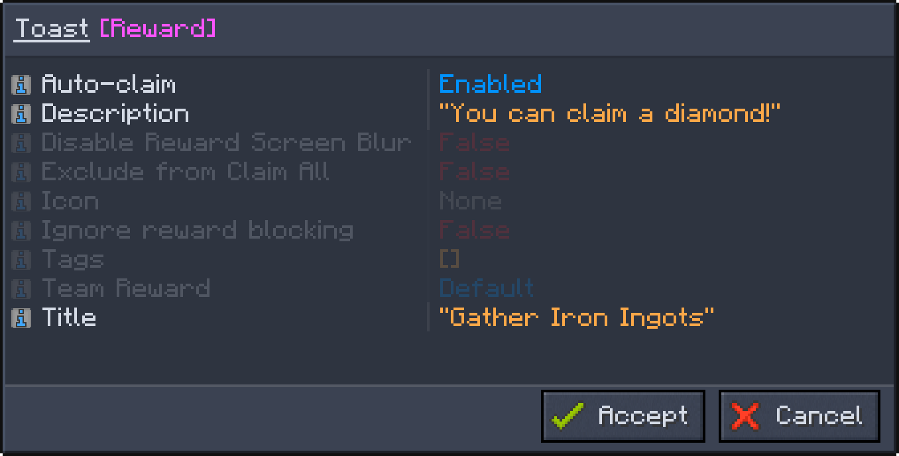

# Toast Reward

A toast reward displays a pop-up for the player. The only use is for information.

## Use case example

Let's say you create a quest and edit it.

You then disable the pop-up by setting "Disable Toast Completion" to `True`.

Optionally, set a title. In this example we choose "Gather Iron Ingots".

Hit "Accept".

After your changes, open the quest and add the toast reward (the sign icon) and a diamond.

Now edit the toast reward.

We enable "Auto-claim".

We set the description to "You can claim a diamond!"

We set the title of the toast reward to the title of the quest: "Gather Iron Ingots".

Hit "Accept".

Now, when a player completes the quest, the toast appears in the upper-right corner of the screen.

Toast rewards are therefore an effective way to convey specific information to players.
