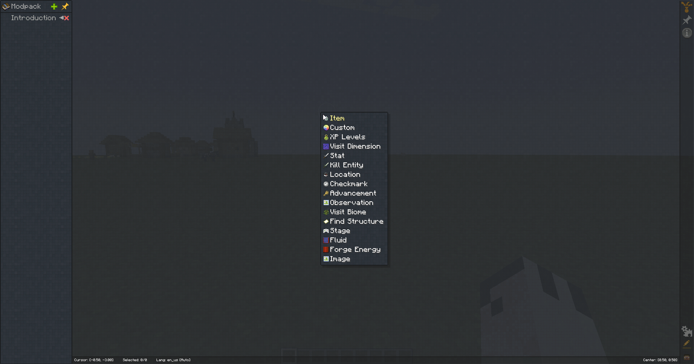

:::info
To create a quest you will first need to create a chapter, a quest is always created inside a chapter and a chapter can
be put inside a chapter group.

For details on creating a chapter, see the [Chapters](../Chapters/index.md) page.
:::

To create a quest, right anywhere in the blank space of the quest book and select the type of quest you want to create.
A detailed explanation of the different quest types can be found on the [Quest Types](./Types.md) page.

After selecting the type of quest you want to create you will be asked to select/enter some intial settings for the quest such
selecting an item needed to complete the quest or how much XP levels the player needs to collect.

With the quest created you will now be able to add additional tasks that the player needs to complete to the quest in addition to
what rewards the player will get for completing the quest.

SCREENSHOT/GIF

