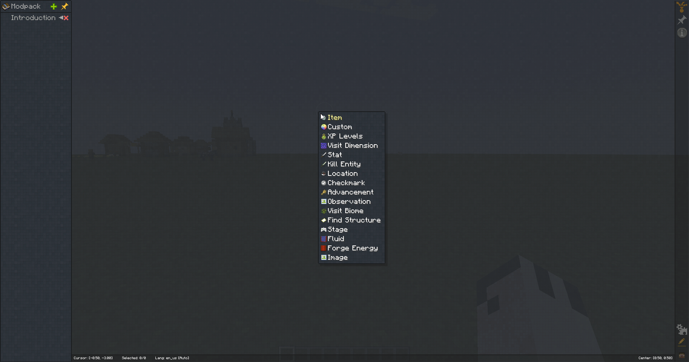
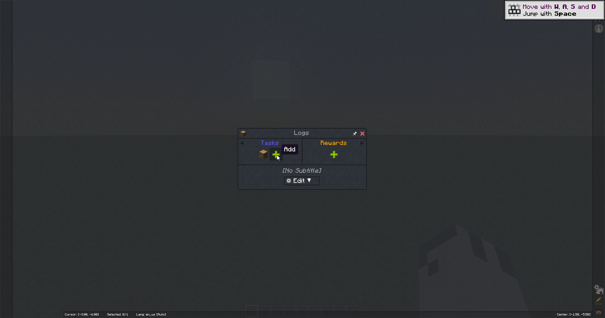
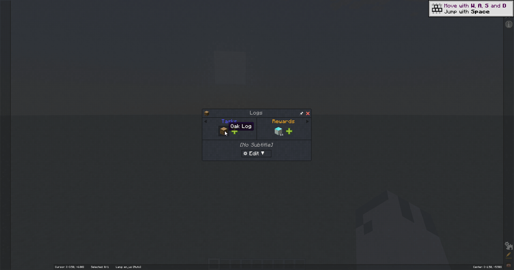
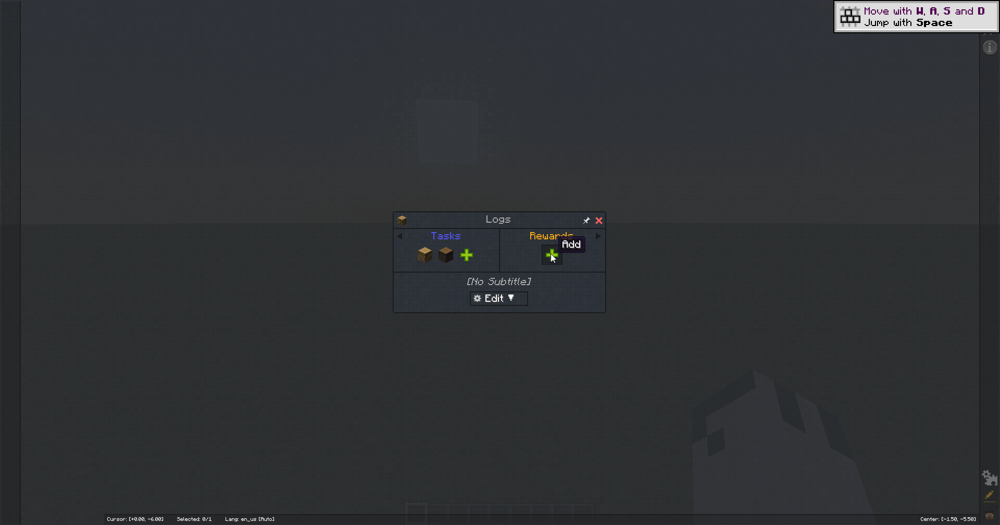

:::info
To create a quest, you will first need to create a chapter, a quest is always created inside a chapter and a chapter can
be put inside a chapter group.

For details on creating a chapter, see the [Chapters](../Chapters/index.md) page.
:::

To create a quest, right anywhere in the blank space of the quest book and select the type of task you want to create. Additional tasks can be added to the quest later (see [Quest Tasks](#quest-tasks)).

A detailed explanation of the different quest types can be found on the [Quest Types](./Types.md) page.

After selecting the type of quest you would like to create, you will be asked to select/enter some initial settings for the quest such
selecting an item needed to complete the quest or how much XP levels the player needs to collect.

With the quest created, you will now be able to add additional tasks that the player must complete to the quest, in addition to
what rewards the player will get for completing the quest.

### Quest Tasks

You can add additional tasks to a quest by clicking the `+` button in the tasks section of the quest.
This will allow you to select the type of task you want to add to the quest again.

#### Using item tags

When creating a task that requires the player to collect a certain item, you can use item tags to make the task more flexible.

For example, if you want the player to collect any type of wood, you can create the quest with an item task and select oak planks as the item.

Now you can right-click the task and select `Convert to 'FTB Filter System' Tag Filter`, this will open a new window that allows you to select which tag you want to use.

### Quest Rewards

Quests rewards can be added by clicking the `+` button in the rewards section of the quest window.
This will open a window where you can select the type of reward you would like to add to the quest.

