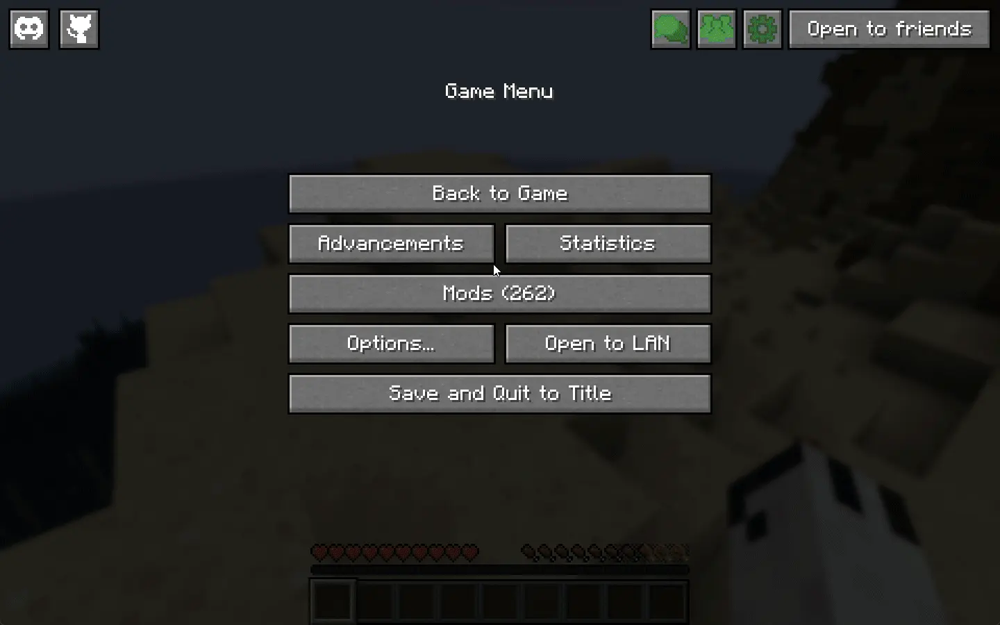
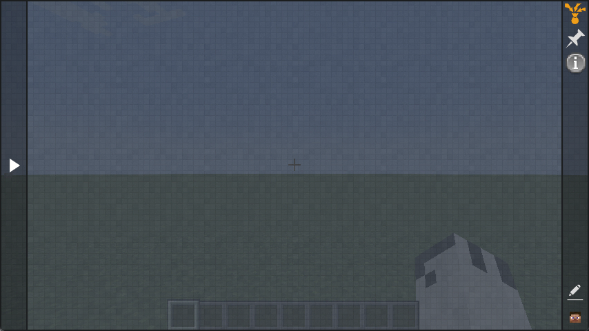
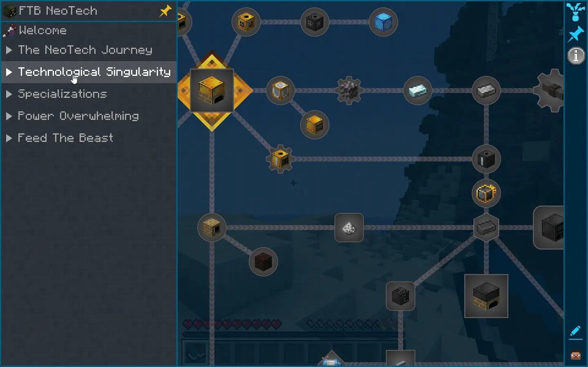

The quest book is a simple and easy-to-use way to track your progress in the game. It is divided into chapters, each of which contains a number of quests. Each quest has a title, a description, and a set of objectives that you need to complete in order to finish it. When you complete a quest, you will be rewarded with items, experience, or other rewards.

## How to open the quest book

You can open the quest book by opening your inventory and clicking on the book icon in the top left of the screen. This will open the quest book interface, where you can see all of the quests and chapters that are available.

There is also a quest book item that you can craft and use to open the quest book interface.

If you are playing a modpack that does not have any quests added to it the quest book will be empty.

On modpacks that have quests such as FTB NeoTech, you will see a list of chapters on the left side of the screen. Clicking on a chapter will show you the quests that are available in that chapter.

:::tip
Some quests and chapters may be hidden until you complete other quests or chapters first.
:::

