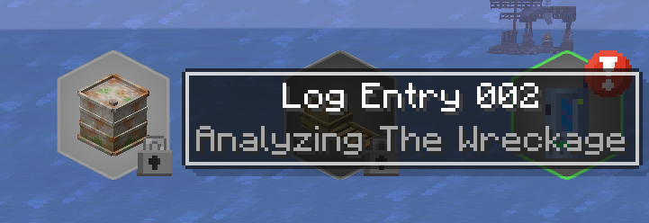
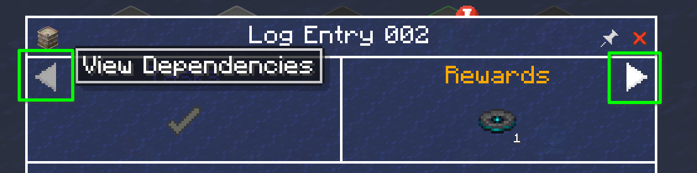
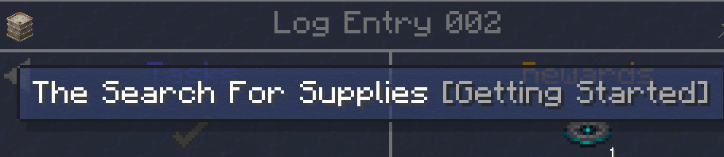
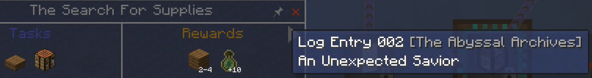
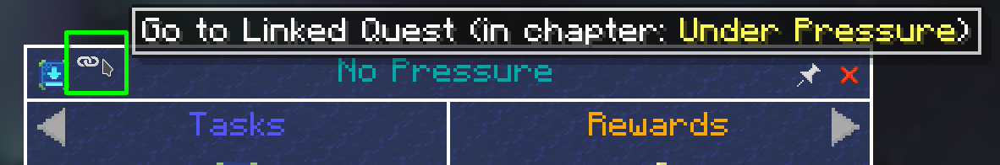

## Auto-pinning quests

You can tell FTB Quests to automatically pin quests, so they are always visible. To accomplish this, open the quest book and click the pin icon in the top right of the screen.
This will pin all the quests in the quest book, in large modpacks this may cause the list of quests to go off the screen.

## Locked Quests / Dependencies / Dependents

Sometimes a quest will be locked but you cannot see the incomplete dependency quest(s) because it is in a different quest Chapter.

If you click the small Left Arrow in the quest, you can open a dropdown that lists all of the dependencies of the quest.

You can click on a quest in the list to be taken directly to the quest. Note that the chapter the dependency quest is in is listed here in `[brackets]` if the quest is not in the current chapter.

You can also use the Right Arrow on the top right of the quest to see a dropdown listing all of the Dependent quests.

## Linked Quests

Some quests may be "Linked". This means the same quest is displayed in more than one location in the questbook.

You can jump between the linked quests by clicking the link icon in the titlebar of the quest.

If the quest is a link, the button will be on the left side. If the quest is the original, the button will be on the right and will give a dropdown when clicked because there can be more than one quest link(s) from it.
