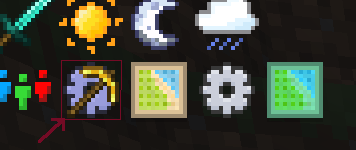

## What is Ultimine?

FTB Ultimine is our take on a vein miner like mod. It allows you to mine blocks in a variety of different ways by holding a key whilst mining. 

- **Efficient Block Harvesting**: Hold the configurable Tilde/Grave key to harvest multiple blocks simultaneously, streamlining your mining process.
- **Enhanced Visuals**: Experience improved visual cues with white lines around blocks slated for mining, harvesting or hoeing, gain an insight to what you're about to ultimine. No more accidents!
- **Hoe Usage for Grass**: Extend the functionality to farming by using a hoe on grass in a similar manner to till multiple blocks at once, saving you time and effort!
- **Shovel Usage for Grass**: As with hoeing, flattening large areas of grass or dirt into a path is easier with FTB Ultimine!
- **Axe Usage for Logs and Copper Blocks**: You can also strip the bark from multiple logs, or the wax from multiple copper blocks!
- **Crop Harvesting**: Simplify the harvesting of crops by right-clicking on them, offering a convenient way to gather resources effortlessly!
- **Special Handling for Grass**: Take advantage of special handling for grass-like blocks, allowing non-adjacent blocks to be selected for quick breaking!
- **Mining Assist**: With ultimine you can also dig tunnels with ease, from a staircase up or down, to your next mineshaft!

## Commands

See [In-game Config Screen](/docs/mods/technical/Config-Screen) for more information about the in-game config screen.

| Command | Description | Requires OP |
| --- | --- | --- |
| `/ftbultimine clientconfig` | Opens the client configuration screen | `N` |
| `/ftbultimine serverconfig` | Opens the server configuration screen | `Y` |

These config screens can also be accessed from the standard FTB sidebar:

## Mining Shapes

We support a variety of different mining shapes that can be switched on the fly in-game. To read more about these options, see [Mining Shapes](/docs/mods/suite/Ultimine/shapes).
