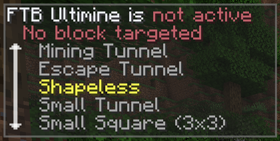

## What are Mining Shapes?

FTB Ultimine has a variety of mining shapes that can control which blocks are actually selected for breaking when you hold the Ultimining key, by pressing <code>\`</code> (backtick) by default (or on MacOS, `\` by default). The Ultimining keybind can be changed via the standard vanilla **Options -> Controls...** screen.

## Options

While holding the Ultimine key, you will see a panel in the top-left of the screen similar to the panel below. You can select a shape by sneaking (hold Shift by default) and scrolling with the mouse wheel or cursor Up/Down keys. If Ultimining isn't possible, the reason why will be shown (requires recent 1.21+ builds of the mod).

:::tip
If you would rather not have to sneak to scroll, this can be changed in client config with the "Require Sneak for Shape Menu" option. If you would like to be able to cycle shapes with the keyboard, without needing the panel open at all, see the "Require Ultimine Key for Shape Cycling" option in client config.
:::

:::tip
The panel can be moved to other areas of the screen in client config; see the "Overlay Panel Position" and X/Y Inset settings.
:::

### Options List

Where you see `Y`, this means a variable distance. The distance is controlled by the Ultimine server config, via the "Max Blocks per Operation" setting.

| Option | Description |
| --- | --- |
| `Shapeless` | Shapeless mode allows you to mine blocks in a shapeless manner. This means there is no specific size or pattern used; the blocks selected depend on the initial block you mine. |
| `Small Tunnel` | Mines a 1x`Y` tunnel. |
| `Large Tunnel (3x3)` | Mine a 3x3x`Y` tunnel. |
| `Small Square (3x3)` | Small square mode allows you to mine a 3x3 area. |
| `Mining Tunnel` | Mining Tunnel mode allows you to mine downwards in a stair-like manner |
| `Escape Tunnel` | Escape Tunnel mode allows you to mine upwards in a stair-like manner |
