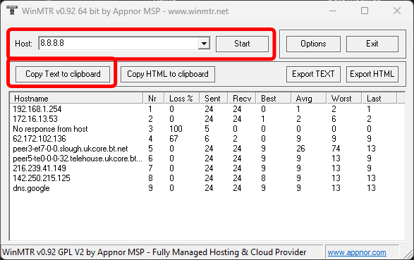
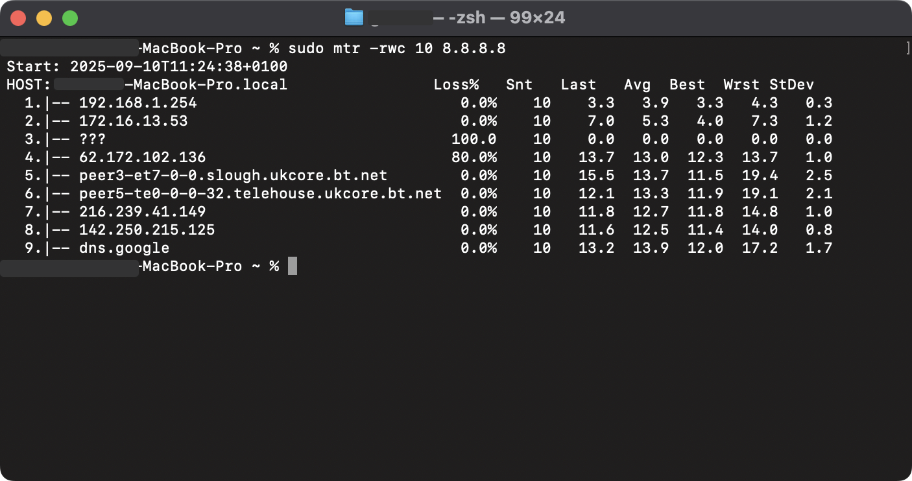

import Tabs from '@theme/Tabs';
import TabItem from '@theme/TabItem';
import {Slideshow} from "../../../src/components/SlideShow/Slideshow";

## Running an MTR

MTR (or My Traceroute) is a tool that helps find any network issues between you and the server you are trying to connect to. It combines the functionality of the `traceroute` and `ping` commands to provide a detailed view of the path your connection takes to reach the server and highlights any potential issues along the way.

<Tabs groupId="mtr-os">
    <TabItem value="windows" label="Windows" default>
        ### Running an MTR on Windows

        1. Download and install WinMTR from https://sourceforge.net/projects/winmtr/
        2. Open WinMTR
        3. In the `Host` textbox, enter the IP address or domain name of the server you are trying to connect to
        4. Click on the `Start` button to begin the MTR test
        5. Let it run for a few minutes to gather enough data
            - Ideally let it run for at least 1 minute, but longer is better
        6. Click on the `Stop` button to end the test
        7. Now click on the `Copy Text to Clipboard` button to copy the results
        8. Paste the results into a text file or directly into where you are seeking help

        
    </TabItem>
    <TabItem value="macos" label="MacOS">
        ### Running an MTR on MacOS

        1. If you don't have Homebrew installed, go to https://brew.sh/ and follow the instructions to install it
        2. Open the Terminal application
        3. Install MTR by running the following command:
        ```bash
        brew install mtr
        ```
        4. Once MTR is installed, you can run it by typing the following command
            - Replace `[server-ip-or-domain]` with the IP address or domain name of the server
            - If you don't have `sudo` privileges, you will need to ask someone who does to run the command for you
        ```bash
        sudo mtr -rwc 100 [server-ip-or-domain]
        ```
        5. You will be prompted to enter your password, type it in and press Enter
        6. It will now run the MTR test and once its complete, it will display the results in the terminal
        7. Copy the results from the terminal and paste them into a text file or directly into where you are seeking help
            - You can also just take a screenshot of the terminal window if you prefer, but make sure all the results are visible

        


    </TabItem>
</Tabs>
