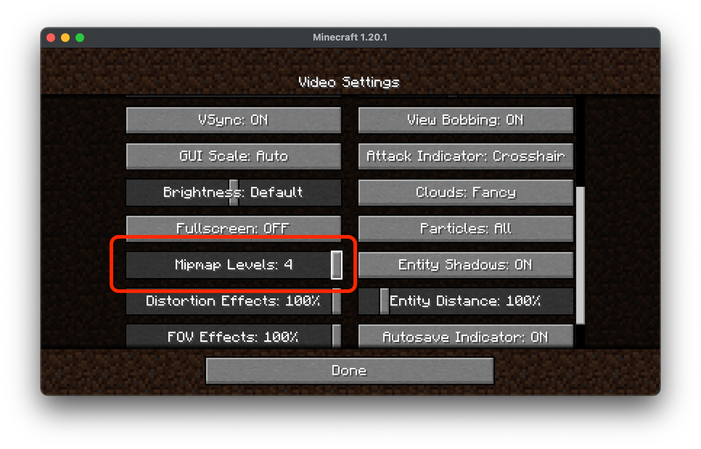

Due to the way that AMD graphics cards handle OpenGL's Mip Mapping system it can sometimes lead to frame stuttering and low FPS.

Luckily, the solution for this is nice and simple!

## Turn of Mipmaps

- Start the game
- Go to `options`
- Then `Video Settings`
- Finally find the slider called `Mipmap Levels` and drag this slider to the left until the text shows `OFF`. Typically you will need to scroll down to find the `Mipmap Levels` option.

After doing this you should be able to see much better FPS performance and less frame stuttering whilst you're enjoying our Modpacks!

## Image Guide

### Find options

### Video settings

### Mipmap Option

This is what the Mipmap setting will normally look like

You'll want to make it look like this

