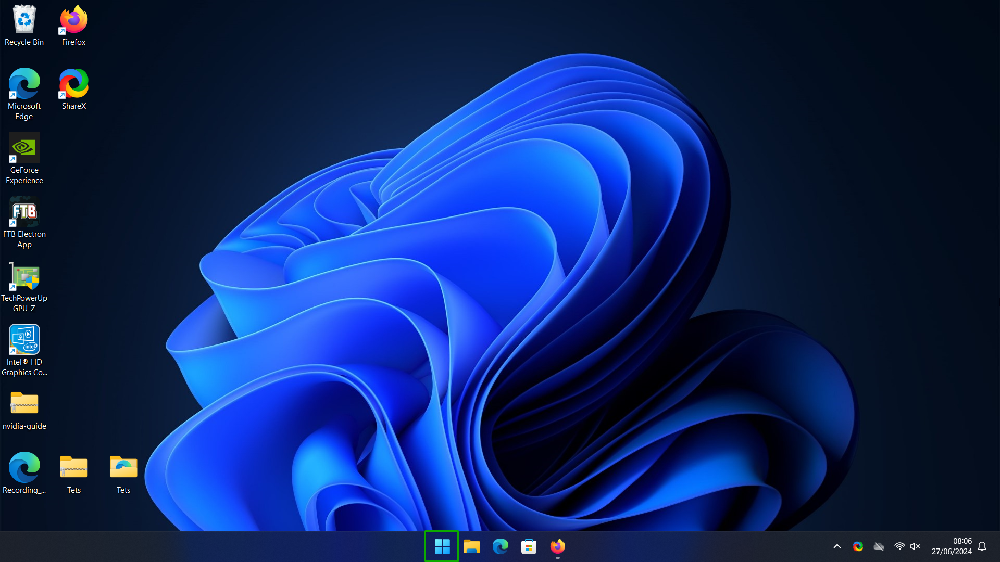
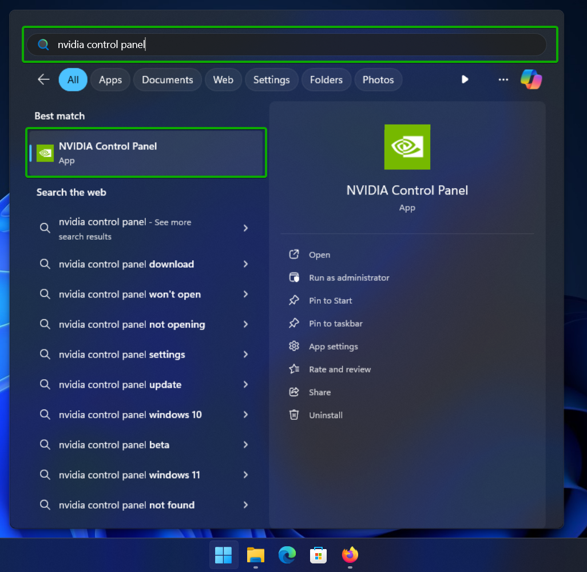
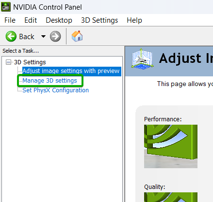
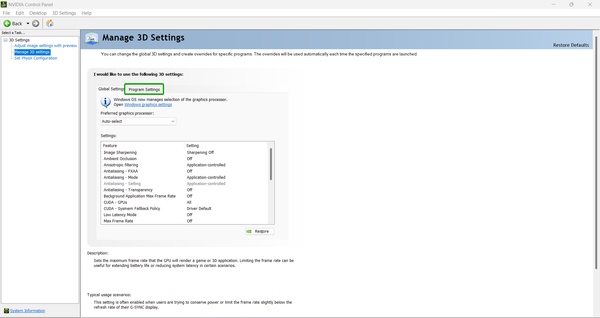
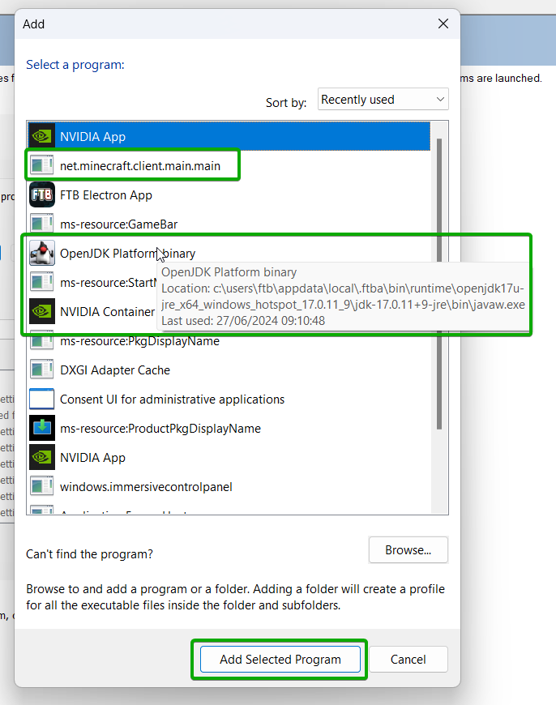
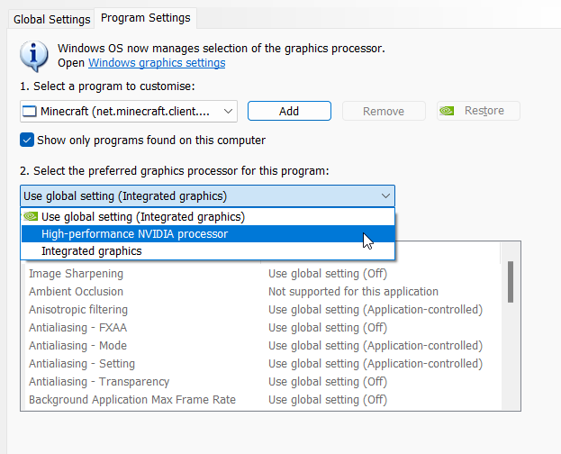
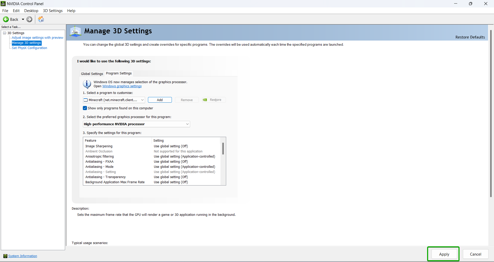

import Admonition from '@theme/Admonition';
import Tabs from '@theme/Tabs';
import TabItem from '@theme/TabItem';

If you have a laptop with both an integrated GPU and a dedicated GPU, Minecraft may use the integrated GPU by default. This can cause performance
as well as issues launching the game. To fix this, you can force Minecraft to use the dedicated GPU.

<Tabs>
    <TabItem value="nvidia" label="NVIDIA">
        To force Minecraft to use the dedicated GPU on NVIDIA, follow these steps:
        1. Open the start menu.

        

        2. Search for `NVIDIA Control Panel` and open it.

        

        3. In the `NVIDIA Control Panel`, click on `Manage 3D settings` in the left sidebar.

        

        4. Click on the `Program Settings` tab.

        

        5. Click on the `Add` button

        

        6. Click on `OpenJDK Platform Binary` in the list of programs, then click on the `Add Selected Program` button.
            - Its possible that multiple `OpenJDK Platform Binary` programs are listed. In this case you can hover over each one with your mouse
            to see the full path. You will want to select the one that is located in the `.ftba` directory. If there are multiple, you will want to repeat this step for each one.
            - You might also see `net.minecraft.client.main.main` in the list of programs. If you do, you will want to repeat this step for that program as well.

        

        7. In the `Select the preferred graphics processor for this program` dropdown, select `High-performance NVIDIA processor`.

        

        8. Apply the changes by clicking on the `Apply` button in the bottom right corner.

        
    </TabItem>
    <TabItem value="amd" label="AMD">
        <Admonition type="caution">
            We currently dont have a guide on how to force Minecraft to use the dedicated GPU on AMD.

            Please join our [Discord](https://go.ftb.team/discord) and ask in the `#help-and-support` channel for help.
        </Admonition>
    </TabItem>
</Tabs>
