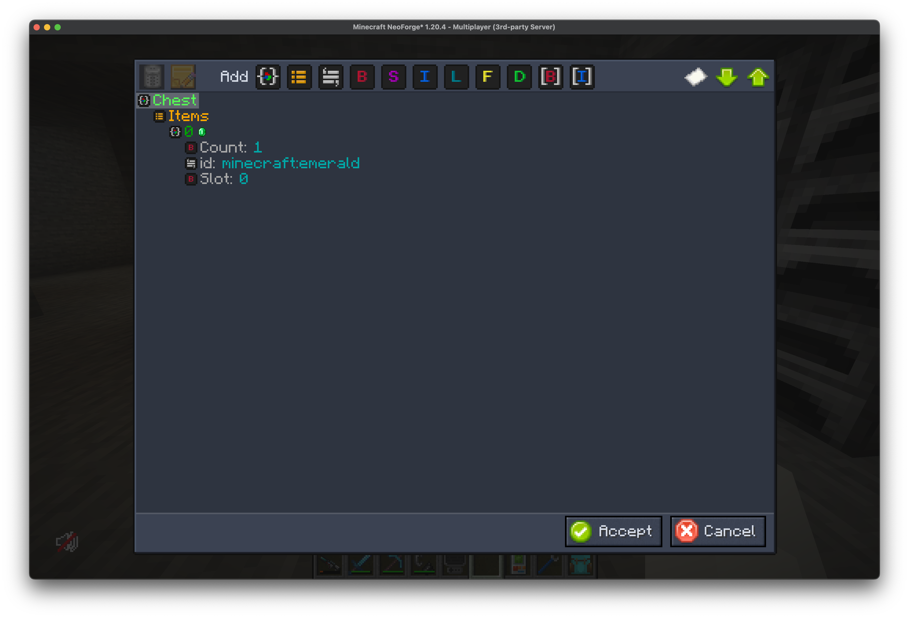
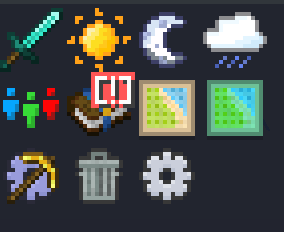

## What is FTB Library?

FTB Library is one of our core mods / library mod that is a collection of common code, utilities, and features that are utilized across all of our mods. 

## Features

- `Custom UI` system that is used to create GUI's in all of our mods
- `Sidebar System` that is used to dynamically create sidebar icons for quick access for the user. This can do an array of different things, primarily run commands, open GUI's, or open a URL.
- `Config system` that is used to create and manage config files for mods. This system is used by all of our mods to create and manage their config files.
- `Utility commands` such as `/ftblibrary gamemode` and `/ftblibrary rain`, etc.
- `NBT Editor` for viewing and editing the NBT data of blocks, entities, items and players.

## Commands

| Command                                 | Description                                                     | Requires OP |
|-----------------------------------------|-----------------------------------------------------------------|-------------|
| `/ftblibrary gamemode`                  | Quick toggle between creative and survival                      | `Y`         |
| `/ftblibrary rain`                      | Toggle rain                                                     | `Y`         |
| `/ftblibrary clientconfig`              | Opens the client config for FTB Library                         | `N`         |
| `/ftblibrary nbtedit block <x> <y> <z>` | Opens the NBT Editor for the block entity at the given position | `Y`         |
| `/ftblibrary nbtedit entity <entity>`   | Opens the NBT Editor for an entity (except players)             | `Y`         |
| `/ftblibrary nbtedit player <player>`   | Opens the NBT Editor for a player                               | `Y`         |
| `/ftblibrary nbtedit item`              | Opens the NBT Editor for the item in your main hand             | `Y`         |

## Client config

FTB Library's own client config is `ftblibrary-client.json5`, and you can open it in-game with `/ftblibrary clientconfig`.

| Option                                    | Default    | Description                                                                                                   |
|-------------------------------------------|------------|---------------------------------------------------------------------------------------------------------------|
| `Show Mod Name in Item Select GUI`        | `false`    | Show the mod name on items in the item selection GUI. Off by default because many other mods already do this. |
| `Show Mod Name in Fluid Select GUI`       | `true`     | Show the mod name on fluids in the fluid selection GUI                                                        |
| `Show Mod Name in Image Select GUI`       | `true`     | Show the mod name on images in the image selection GUI                                                        |
| `Show Mod Name in Entity Face Select GUI` | `true`     | Show the mod name on entities in the entity face selection GUI                                                |
| `Enable Sidebar Buttons`                  | `true`     | Show the sidebar                                                                                              |
| `Position of Sidebar Buttons`             | `top_left` | Where the sidebar sits on screen: `top_left`, `top_right`, `bottom_left` or `bottom_right`                    |


## NBT Editor

The NBT Editor is a powerful tool that allows you to edit NBT data in a user-friendly way. You can edit the NBT data of blocks, entities, items, and players. The NBT Editor is accessible in-game by running the `/ftblibrary nbtedit` command.

| Key          | Action                         |
|--------------|--------------------------------|
| `+` / `=`    | Expand all entries             |
| `-`          | Collapse all entries           |
| `Ctrl` + `C` | Copy the NBT to your clipboard |



## Sidebar System

The Sidebar System can be used to display a dynamic array of buttons on the inventory screen as shortcuts for the user. Many FTB Mods add one or more buttons to the sidebar by default.



### Editing the sidebar

Right-click a sidebar button to enter edit mode. In edit mode you can:

- Drag buttons to move them.
- Click the small `x` on a button to hide it.
- Click the `+` box to add hidden buttons back.

Right-click again, or click away from the sidebar, to leave edit mode. 

The gear/cog button opens the client config, where you can turn the sidebar off or change its position.

### Modpack creators

Your layout is saved under `sidebar.buttons` in `ftblibrary-client.json5`. To ship a default layout with your pack, arrange the sidebar in-game and then include `config/ftblibrary-client.json5` in your modpack. Each entry is keyed by the button ID:

```json5
{
  sidebar: {
    buttons: {
      "ftblibrary:toggle/day": { enabled: false, x: 1 },
      "ftbquests:quests": { enabled: true, x: 0, y: 0 }
    }
  }
}
```

You can also use a resource pack to override a button's JSON file, for example to set `requires_op` to `true` or change its `sort_index`. To hide a button by default, set `enabled: false` for it in `sidebar.buttons` as shown above.

### Adding your own buttons

Any mod or resource pack can add a sidebar button by adding a JSON file at `assets/<namespace>/sidebar_buttons/<path>.json`. The button ID is `<namespace>:<path>`. For example, `assets/ftblibrary/sidebar_buttons/toggle/day.json` adds the button `ftblibrary:toggle/day`.

| Field                   | Required | Default | Description                                                                                                                                                       |
|-------------------------|----------|---------|-------------------------------------------------------------------------------------------------------------------------------------------------------------------|
| `icon`                  | Yes      |         | The button's icon (see [Icons](#icons))                                                                                                                           |
| `click`                 | Yes      |         | A list of actions to run when the button is clicked (see [Click actions](#click-actions))                                                                         |
| `shift_click`           | No       |         | A list of actions to run when the button is shift-clicked                                                                                                         |
| `default_enabled`       | No       | `true`  | Currently has no effect. Use `sidebar.buttons` in the client config to hide buttons by default                                                                    |
| `sort_index`            | No       | `0`     | The button's position in the sidebar. Lower numbers come first                                                                                                    |
| `tooltip`               | No       |         | A list of text components added to the tooltip                                                                                                                    |
| `shift_tooltip`         | No       |         | A list of text components added to the tooltip while holding Shift                                                                                                |
| `requires_op`           | No       | `false` | Only show the button to players with op permissions                                                                                                               |
| `required_mods`         | No       |         | A list of mod IDs. The button only shows when all of them are loaded                                                                                              |
| `loading_screen`        | No       | `false` | Show a loading screen while the click action runs                                                                                                                 |
| `environment_condition` | No       |         | The name of an environment variable. The button only shows when that variable is set. Prefix it with `!` to show the button only when the variable is **not** set |

The button's name comes from the language key `sidebar_button.<namespace>.<path>`, with `/` replaced by `.`. If you add a `sidebar_button.<namespace>.<path>.tooltip` key, it is shown as extra tooltip text while holding Shift.

Here is the button that sets the time to day:

```json
{
  "icon": ["ftblibrary:textures/icons/toggle_day.png"],
  "sort_index": 200,
  "click": ["command:/time set minecraft:day"],
  "requires_op": true
}
```

#### Click actions

Each action in `click` and `shift_click` is a string:

| Action             | Example                        | Description                                                                                  |
|--------------------|--------------------------------|----------------------------------------------------------------------------------------------|
| `command:`         | `command:/ftbquests open_book` | Runs a command as the player                                                                 |
| `http:` / `https:` | `https://feed-the-beast.com`   | Opens a URL. The player is asked to confirm first if their "Chat Links Prompt" setting is on |
| `file:`            | `file:/path/to/file.txt`       | Opens a file on the player's computer                                                        |
| `custom:`          | `custom:ftbteams:open_gui`     | Sends a custom click event that a mod can handle                                             |

Any other value of the form `namespace:path`, such as `ftbteams:open_gui`, is also sent as a custom click event.

#### Icons

`icon` is a list of icon strings, drawn on top of each other in order. Each string can be one of:

| Icon    | Example                                    | Description                                                                       |
|---------|--------------------------------------------|-----------------------------------------------------------------------------------|
| Texture | `ftblibrary:textures/icons/toggle_day.png` | A texture file. The path must end in `.png` or `.jpg`                             |
| Sprite  | `ftblibrary:icons/settings`                | A sprite from the GUI texture atlas (any ID that doesn't end in `.png` or `.jpg`) |
| Item    | `item:minecraft:diamond`                   | An item's icon                                                                    |
| Color   | `color:#FF0000`                            | A solid color                                                                     |
