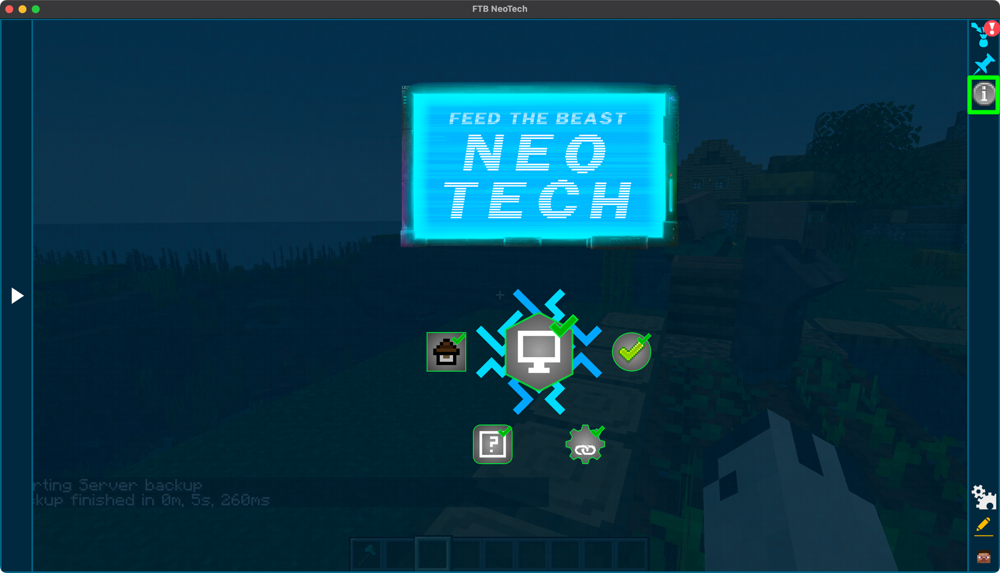
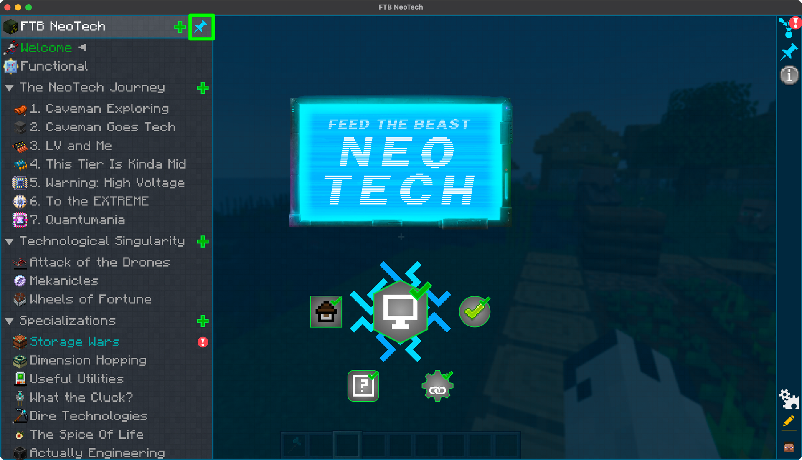
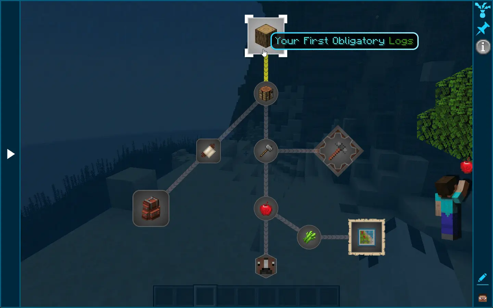
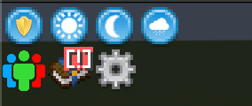
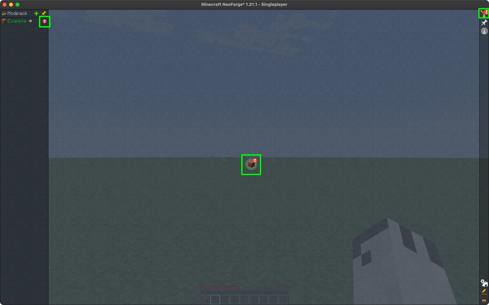

## Key References
FTB Quests has a number of keyboard shortcuts that can help you quickly navigate the quest book, such as <kbd>Ctrl</kbd> + <kbd>F</kbd>
to quickly find a quest.

You can view a full list of key references by opening the quest book, then clicking on the `i` icon in the top right of the screen.

## Showing the chapter list
Moving your mouse cursor to the left of the screen will open the quest book chapter list. Clicking on a chapter will show you the quests available in that chapter.

You can also 'pin' the chapter list open by clicking the pin icon in the top left of the screen. This will keep the chapter list open even when you move your mouse away from it.

## Moving around the quests
Sometimes there may be countless quests in a single chapter. You can move around the quests by clicking and holding your left mouse button on an empty area of the quest screen
and dragging it around. For a full list of way to navigate the quest book, see the key references above.

## Opening a quest
To open a quest, simply click on the quest you would like to view. This will then open a new window with the details of the quests, which includes the quest description, tasks, and rewards.

You can also click on the task to view the crafting recipe or any other extra information about the task.

## Pinning a quest
You can pin a quest so that the quest is always visible to you by opening the quest you want to track the progress of and then clicking on the pin icon

## Completing a quest and claiming rewards

:::info
Some quests may be team based, meaning that once a task is completed by any member of the team, it will be marked as completed for all members of the team, the rewards can also be marked as a team reward.
:::

Once you have completed all the tasks for a quest, you will get a notification in the top right of the screen and an `!` will appear on the quest book icon in your inventory screen.

When you open the quest book, the chapter the quest is in will also have an `!` along with the specific quest that was completed

### Claiming reward

To claim a reward, you can either click on the Claim all button in the top right of the screen.

Or you can open the completed quest and click on the rewards.
Some rewards will allow you to choose between multiple rewards, you can click on the reward you would like to claim.

