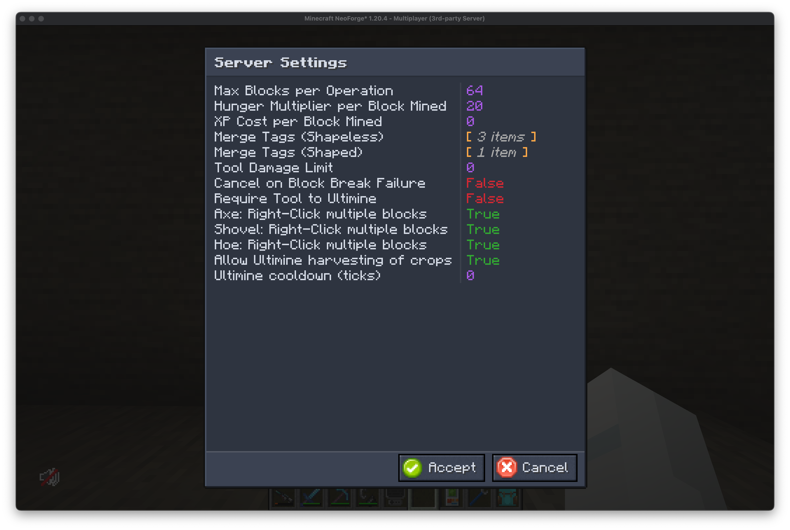

## What is the In-game Config Screen?

Many of our mods support modifying their configuration settings from within the game. This is done through an in-game config screen. The way you access this screen changes depending on the mod, some will use commands, others will use on-screen buttons.

## What does it look like?

The options presented in the in-game config screen will vary depending on the mod. Here are some examples of what you might see:

## What am I seeing

In short, you're looking at a categorized (Although, not shown in the example above) key value pair. Each entry in the config screen will have a key (Typically with a human readable name) and a value. The values can be changed depending on their type. Some values may be simple booleans (True or False), others may be a list of options, or a number. 

## Enriched option support

For the user's convenience, we've built in support for commonly used options that would otherwise be difficult to work with. This includes things like a color picker, Item selection, Fluid selection, and more.
